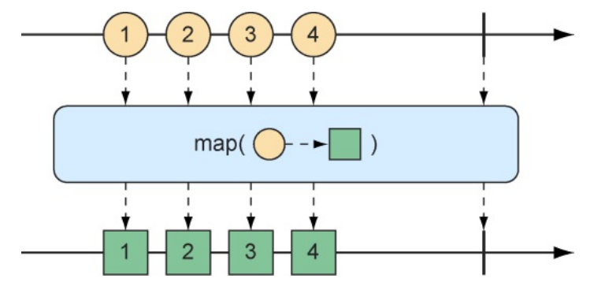
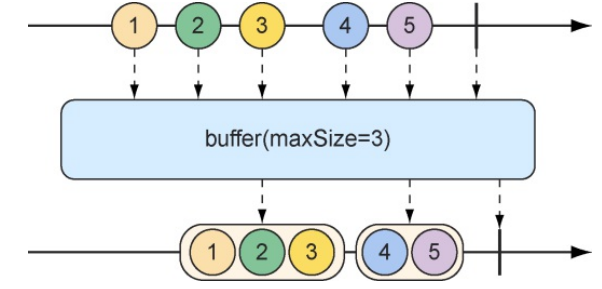

[toc]

反应式流规范可以总结为4个接口：Publisher、Subscriber、 Subscription和Processor。Publisher负责生成数据，并将数据发送给 Subscription（每个Subscriber对应一个Subscription）。

Publisher接口声明 了一个方法 subscribe()，Subscriber可以通过该方法向 Publisher发起订阅。

至于Processor接口，它继承自Subscriber和Publisher，当作为 Subscriber时，Processor会接收数据并以某种方式对数据进 行处理。然后它会将角色转变为Publisher，并将处理的结果发布给它的 Subscriber。 


# springboot集成reactive

## maven依赖

```xml
<!--核心依赖-->
<dependency> 
  <groupId>io.projectreactor</groupId> 
  <artifactId>reactor-core</artifactId> 
</dependency>
<!--测试依赖-->
<dependency> 
    <groupId>io.projectreactor</groupId> 
    <artifactId>reactor-test</artifactId> 
    <scope>test</scope> 
</dependency>
```

## Mono和Flux

Mono和Flux是Reactor的两种核心类型之一，两者都实现了反应式流的Publisher接口。

```java
    public static void main(String[] args) {
        Mono.just("Craig")
                .map(n -> n.toUpperCase())
                .map(cn -> "Hello, " + cn + "!")
                .subscribe(System.out::println);
    }
```

# reactive基本方法

## 创建操作

在Spring中使用反应式类型时，我们通常将会从repository或者 service中获取Flux或Mono，并不需要我们自行创建。即通常我们使用dao层或service层返回的Flux和Mono对象。

偶尔，我们可能需 要创建一个新的反应式Publisher。 Reactor提供了多种创建Flux和Mono的操作。这里，我们将介绍其 中一些有用的创建操作。 

### 对象创建

**just()**

如果你有一个或多个对象，并想据此创建Flux或Mono，那么可以 使用Flux或Mono上的静态 just()方法来创建一个反应式类型。

```java
        // 生产者
        Flux<String> fruitFlux = Flux .just("Apple", "Orange", "Grape", "Banana", "Strawberry");
```

此时我们已经创建了Flux，但是它还没有订阅者。如果没有任何的 订阅者，那么数据将不会流动。要添加一个订阅者，我们可以在Flux上调用subscribe()方法，传递给 subscribe()方法的lambda表达式实际上是一个 java.util.Consumer，用来创建反应式流的Subscriber。在调用subscribe() 之后，数据会开始流动。

```java
        // 订阅者
        fruitFlux.subscribe( f -> System.out.println("Here's some fruit: " + f) );
```

测试Flux或Mono更好的方法是使用Reactor提供的 StepVerifier，而不是打印到控制台。对于给定的Flux或Mono，StepVerifier将会订阅该反应式类 型，在数据流过时对数据应用断言，并在最后验证反应式流是否按预期完成。

```java
        StepVerifier.create(fruitFlux)
                .expectNext("Apple")
                .expectNext("Orange")
                .expectNext("Grape")
                .expectNext("Banana")
                .expectNext("Strawberry")
                .verifyComplete();
```

### 数组创建

要根据数组创建Flux，可以调用Flux上的静态方法fromArray()，并传入一个源数组

```java
    static private void createFromArray() {
        String[] fruits = new String[]{
                "Apple", "Orange", "Grape", "Banana", "Strawberry"};
        Flux<String> fruitFlux = Flux.fromArray(fruits);

        StepVerifier.create(fruitFlux)
                .expectNext("Apple")
                .expectNext("Orange")
                .expectNext("Grape")
                .expectNext("Banana")
                .expectNext("Strawberry")
                .verifyComplete();
    }
```

### 集合创建

如果我们需要根据java.util.List、java.util.Set或者其他任意 java.lang.Iterable 的实现来创建Flux，那么可以将其传递给静态的fromIterable()方法

```java
    static private void createFromList() {
        List<String> fruitList = new ArrayList<>();
        fruitList.add("Apple");
        fruitList.add("Orange");
        fruitList.add("Grape");
        fruitList.add("Banana");
        fruitList.add("Strawberry");
        Flux<String> fruitFlux = Flux.fromIterable(fruitList);
        // ... verify steps
    }
```

### stream创建

```java
    static private void createFromStream() {
        Stream<String> fruitStream = Stream.of("Apple", "Orange", "Grape", "Banana", "Strawberry");
        Flux<String> fruitFlux = Flux.fromStream(fruitStream);

        // ... verify steps
        // 订阅者
        fruitFlux.subscribe(f -> System.out.println("Here's some fruit: " + f));
    }
```

### 自动生成

有时候我们根本没有可用的数据，而只是想要一个作为计数器的 Flux，它会在每次发送新值时增加1。

**range()**

要创建一个计数器Flux，我们可以使用静态方法range()。创建一个区间Flux，起始值为1，结束值为 5

```java
Flux<Integer> intervalFlux = Flux.range(1, 5);
```

**interval()**

另一个与range()方法类似的Flux创建方法是interval()。interval()的特殊 之处在于，我们不是给它设置一个起始值和结束值，而是指定一个应该每隔多长时间发出值的间隔时间。

```java
Flux<Long> intervalFlux2 = Flux.interval(Duration.ofSeconds(1)) .take(5);
```

通过interval()方法创建的Flux会从0开始发布值，并且后续的条目依次递增。此外，因为interval()方法没有指定最大值，所以它可能会永远运行。我们也可以使用take()方法将结果限制为前5个条目。

## 组合操作

有时候，我们会需要操作两种反应式类型，并以某种方式将它们合并在一起。或者，在其他情况下，我们可能需要将Flux拆分为多种反应 式类型。组合操作就是合并或拆分Flux的。

### 合并

**mergeWith()**

```java
    // 合并两个Flux
    public void mergeFluxes() {
        Flux<String> characterFlux = Flux
                .just("Garfield", "Kojak", "Barbossa")
                .delayElements(Duration.ofMillis(500));

        Flux<String> foodFlux = Flux.
                just("Lasagna", "Lollipops", "Apples")
                .delaySubscription(Duration.ofMillis(250))
                .delayElements(Duration.ofMillis(500));

        Flux<String> mergedFlux = characterFlux.mergeWith(foodFlux);
        StepVerifier.create(mergedFlux)
                .expectNext("Garfield")
                .expectNext("Lasagna")
                .expectNext("Kojak")
                .expectNext("Lollipops")
                .expectNext("Barbossa")
                .expectNext("Apples")
                .verifyComplete();
    }
```

通常，Flux 会尽可能快地发布数据。因此，我们在创建的两个Flux流上使用delayElements()方法来减慢它们的速度——每500毫秒发布一个条目。此外，为了使食物Flux在角色名称Flux之后再开始流式传输，我们调用了食物Flux上的delaySubscription()方法，以便它在订阅后再经过 250毫秒后才开始发布数据。

在合并后的 Flux中会交错在一起，结果是：一个角色、一个食物、另一个角色、另一个食物，以此类推。

### 压缩

**zip()**

因为mergeWith()方法不能完美地保证源Flux之间的先后顺序，所以我们可以考虑使用zip()方法。当两个Flux对象压缩在一起的时候，它将会产生一个新的发布元组的Flux，其中每个元组中都包含了来自每个源Flux的数据项。

```java
    public void zipFluxes() {
        Flux<String> characterFlux = Flux.just("Garfield", "Kojak", "Barbossa");
        Flux<String> foodFlux = Flux.just("Lasagna", "Lollipops", "Apples");
        Flux<Tuple2<String, String>> zippedFlux = Flux.zip(characterFlux, foodFlux);
        
        StepVerifier.create(zippedFlux)
                .expectNextMatches(p -> p.getT1().equals("Garfield") && p.getT2().equals("Lasagna"))
                .expectNextMatches(p -> p.getT1().equals("Kojak") && p.getT2().equals("Lollipops"))
                .expectNextMatches(p -> p.getT1().equals("Barbossa") && p.getT2().equals("Apples"))
                .verifyComplete();
    }
```

zip()方法是一个静态的创建操作。 创建出来的Flux在角色和他们喜欢的食物之间会完美对齐。从这个合并后的Flux发出的每个条目都是一个Tuple2（一个容纳两个其他对象的容器对象）的实例，其中包含了来自每个源Flux的数据项，并保持着它们发布的顺序。

如果你不想使用Tuple2，而想要使用其他类型，就可以为zip()方法提供一个合并函数来生成你想要的任何对象，合并函数会传入这两个数据项。

```java
    public void zipFluxesToObject() {
        Flux<String> characterFlux = Flux.just("Garfield", "Kojak", "Barbossa");
        Flux<String> foodFlux = Flux.just("Lasagna", "Lollipops", "Apples");
        Flux<String> zippedFlux =
                Flux.zip(characterFlux, foodFlux, (c, f) -> c + " eats " + f);

        StepVerifier.create(zippedFlux)
                .expectNext("Garfield eats Lasagna")
                .expectNext("Kojak eats Lollipops")
                .expectNext("Barbossa eats Apples")
                .verifyComplete();
    }
```

传递给 zip()方法（在这里是一个lambda）的函数只是简单地将两个数据项组装成一个句子，然后通过该合并后的Flux发布出去。

### 选择第一个反应式类型发布

假设我们有两个Flux对象，此时我们不想将它们合并在一起，而是想要创建一个新的Flux，让这个新的Flux从第一个产生值的Flux中发布值。

下面的测试方法创建了一个快速的Flux和一个“缓慢”的Flux（其中“慢”意味着它在被订阅后100毫秒才会发布数据项）。使用first()方法，它将会创建一个新的Flux，这个Flux只会获取第一个源Flux发布的值，并再次发布。

spring in action中举例的方法first()已过时，我们选择如下的方法

```java
    static public void firstWithSignalFlux() {
        Flux<String> slowFlux = Flux.just("tortoise", "snail", "sloth").delaySubscription(Duration.ofMillis(100));
        Flux<String> fastFlux = Flux.just("hare", "cheetah", "squirrel");
        Flux<String> firstFlux = Flux.firstWithSignal(slowFlux, fastFlux);
        StepVerifier.create(firstFlux)
                .expectNext("hare")
                .expectNext("cheetah")
                .expectNext("squirrel")
                .verifyComplete();
    }
```

## 转换操作

### 过滤方法

在数据流经一个流时，我们通常需要过滤掉某些值并对其他的值进 行处理。

**skip()**

skip操作将创建一个新的Flux，它会首先跳过指定数量的数据项，然后从源 Flux 中发布剩余的数据项。

```java
    public void skipAFew() {
        Flux<String> skipFlux = Flux
                .just("one", "two", "skip a few", "ninety nine", "one hundred")
                .skip(3);
        StepVerifier.create(skipFlux)
                .expectNext("ninety nine", "one hundred")
                .verifyComplete();
    }
```

**take()**

skip操作会跳过前面几个数据项，而take操作只发布第一批指定数量的数据项，然后将取消订阅.

```java
    public void take() {
        Flux<String> nationalParkFlux = Flux
                .just("Yellowstone", "Yosemite", "Grand Canyon", "Zion", "Grand Teton")
                .take(3);
        StepVerifier.create(nationalParkFlux)
                .expectNext("Yellowstone", "Yosemite", "Grand Canyon")
                .verifyComplete();
    }
```

与skip()方法一样，take()方法也有另一种替代形式，基于间隔时间而不是数据项个数。此处不细表。

**filter()**

skip操作和take操作都可以被认为是过滤操作，其过滤条件是基于计数或者持续时间的，而Flux值的更通用过滤则是filter操作。其实只需掌握filter()即可。过滤条件我们可以自己实现，很灵活也很方便。

我们需要指定一个Predicate，用于决定数据项是否能通过Flux，filter操作允许我们根据任何条件进行选择性地发布。

```java
    public void filter() {
        Flux<String> nationalParkFlux = Flux
                .just("Yellowstone", "Yosemite", "Grand Canyon", "Zion", "Grand Teton")
                .filter(np -> !np.contains(" "));
        
        StepVerifier.create(nationalParkFlux)
                .expectNext("Yellowstone", "Yosemite", "Zion")
                .verifyComplete();
    }
```

**distinct()**

想要过滤掉已经接收过的数据条目，即给数据去重，可以采用distinct操 作

```java
    public void distinct() {
        Flux<String> animalFlux = Flux
                .just("dog", "cat", "bird", "dog", "bird", "anteater")
                .distinct();
        
        StepVerifier.create(animalFlux)
                .expectNext("dog", "cat", "bird", "anteater")
                .verifyComplete();
    }
```


### 映射方法

在Flux或Mono上最常见的操作之一就是将已发布的数据项转换为其他的形式或类型。Reactor的反应式类型（Flux和Mono）为此提供了map和flatMap操作。

**map()**



```java
    public void map() {
        Flux<Player> playerFlux = Flux
                .just("Michael Jordan", "Scottie Pippen", "Steve Kerr").map(n -> {
                    String[] split = n.split("\\s");
                    return new Player(split[0], split[1]);
                });
        StepVerifier.create(playerFlux)
                .expectNext(new Player("Michael", "Jordan"))
                .expectNext(new Player("Scottie", "Pippen"))
                .expectNext(new Player("Steve", "Kerr"))
                .verifyComplete();
    }
```

这里的map()方法用法和java的stream基本一致。

重要的一点是：在每个数据项被源Flux发布时，map操作是同步执行的，如果你想要异步地转换过程，那么你应该考虑使用flatMap操作。

**flatmap()**

我们为flatMap()方法指定了一个lambda形式的函数，传入的String将会转换为一个Mono类型的String，然后在这个Mono上通过map()方法将字符串转换为一个Player。

```java
    public void flatMap() {
        Flux<Player> playerFlux = Flux
                .just("Michael Jordan", "Scottie Pippen", "Steve Kerr")
                .flatMap(
                        n -> Mono.just(n)
                                .map(p -> {
                                    String[] split = p.split("\\s");
                                    return new Player(split[0], split[1]);
                                })
                                .subscribeOn(Schedulers.parallel())
                );
        List<Player> playerList = Arrays.asList(new Player("Michael", "Jordan"), new Player("Scottie", "Pippen"), new Player("Steve", "Kerr"));
        StepVerifier.create(playerFlux)
                .expectNextMatches(p -> playerList.contains(p))
                .expectNextMatches(p -> playerList.contains(p))
                .expectNextMatches(p -> playerList.contains(p))
                .verifyComplete();
    }
```

但是我们对Mono做的最后一个动作就是调用subscribeOn()方法，它声明每个订阅都应该在并行线程中进行，因此可以异步并行地执行多个String对象的转换操作。

尽管subscribeOn()方法的命名与subscribe()方法类似，但是它们的含义却完全不同。subscribe()方法是一个动词，订阅并驱动反应式流；而subscribeOn()方法则更具描述性，指定了如何并发地处理订阅。subscribeOn()支持好几种线程处理方式，具体请参考官方资料。

我们可以在多个并行线程之间拆分工作，从而增加流的吞吐量。但因为工作是并行完成的，无法保 证哪项工作首先完成，所以结果Flux中数据项的发布顺序是未知的。

### 缓存数据

在处理流经Flux的数据时，你可能会发现将数据流拆分为小块会带来一定的收益。



下面代码给定一个包含多个String值的Flux，其中每个值代表一种水果的名称，我们可以用 buffer() 创建一个新的包含List 集合的Flux，其中每个List只有不超过指定数量的元素。

```java
    public void buffer() {
        Flux<String> fruitFlux = Flux.just("apple", "orange", "banana", "kiwi", "strawberry");
        Flux<List<String>> bufferedFlux = fruitFlux.buffer(3);
        
        StepVerifier.create(bufferedFlux)
                .expectNext(Arrays.asList("apple", "orange", "banana"))
                .expectNext(Arrays.asList("kiwi", "strawberry"))
                .verifyComplete();
    }
```

String元素的Flux被缓冲到一个新的包含List集合的Flux中，其中每个集合不超过3个条目。因此，发出5个String值的原始Flux将会被转换为一个新的Flux，它会发出两个List集合，其中一个包含3个水果，而另一个包含2个水果。 

这有什么意义呢？将反应式的Flux缓冲到非反应式的Flux中看起来适得其反，但是，当组合使用buffer()方法和flatMap()方法时，我们可以对每个List集合进行并行处理。 

```java
        Flux.just("apple", "orange", "banana", "kiwi", "strawberry")
                .buffer(3)
                .flatMap(x ->
                        Flux.fromIterable(x)
                            .map(y -> y.toUpperCase())
                            .subscribeOn(Schedulers.parallel())
                            .log()
                ).subscribe();
```

新例子中，我们仍然将5个String值的Flux缓冲到一个新的包含List的Flux中，但是这次将flatMap()应用于包含List集合的Flux。这将获取每个List缓冲区，并为其中的元素创建一个新的Flux，然后对其应 用map操作。因此，每个List缓冲区都会在各个线程中执行进一步并行处理。

log()操作记录了所有的反应式事件，以便于观察实际发生了什么事情。

### 收集数据

一种有趣的收集Flux发出的数据项的方法是将它们收集到Map中。collectMap 操作将会产生一个发布Map的Mono， 这个Map中填充了由给定Function计算key值所生成的条目。

下面代码中key值就是动物的首字母，键值就是对应动物。注意Map中不能存在重复的 key。

```java
    public void collectMap() {
        Flux<String> animalFlux = Flux.just("aardvark", "elephant", "koala", "eagle", "kangaroo");
        Mono<Map<Character, String>> animalMapMono = animalFlux.collectMap(a -> a.charAt(0));
        
        StepVerifier.create(animalMapMono).expectNextMatches(map -> {
            return map.size() == 3 
                    && map.get('a').equals("aardvark") 
                    && map.get('e').equals("eagle") 
                    && map.get('k').equals("kangaroo");
        }).verifyComplete();
    }

```

## 逻辑操作

有时候我们想要知道由Mono或者Flux发布的条目是否满足某些条件，那么all()和any()方法可以实现这样的逻辑。这和stream中的逻辑操作类似。

**all()**

```json
    public void all() {
        Flux<String> animalFlux = Flux.just("aardvark", "elephant", "koala", "eagle", "kangaroo");
        Mono<Boolean> hasAMono = animalFlux
                .all(a -> a.contains("a"));
        
        StepVerifier.create(hasAMono)
                .expectNext(true)
                .verifyComplete();
    }
```

**any()**

```json
Mono<Boolean> hasAMono = animalFlux.any(a -> a.contains("t"));
```

# reactive web层

当前项目没有直接使用spring reactive处理web请求，此节等有时间或项目用到该技术再补。

# reactive持久层

在spring in action 第5版写作时，关系型数据库如mysql，还未支持反应式模型。本章暂省略。