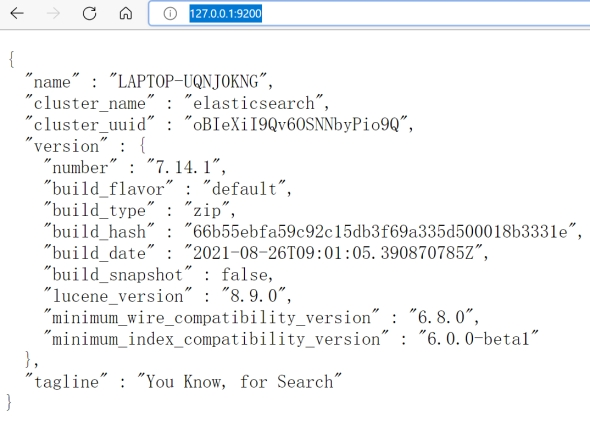

# es的起源

Elasticsearch是一个实时分布式搜索和分析引擎，它让你以前所未有的速度处理大数据。es常用于全文搜索、结构化搜索、分析以及将这三者混合使用，它是当下业界最流行的开源搜索框架。很多流行的网站采用es来提供搜索功能。

## lucene

说到搜索领域，不得不提Doug Cutting。他开发了lucene，一个用于文本搜索的函数库。2004年，Doug Cutting再接再励，在Lucene的基础上，和Apache开源伙伴Mike Cafarella合作，开发了一款可以代替当时的主流搜索的开源搜索引擎，命名为Nutch。Nutch是一个建立在Lucene核心之上的网页搜索应用程序，可以下载下来直接使用。它在Lucene的基础上加了网络爬虫和一些网页相关的功能，目的就是从一个简单的站内检索推广到全球网络的搜索上，就像Google一样。

后来，Doug Cutting加盟Yahoo，基于google和业界的一些研究成果，开创了流行的大数据框架hadoop。

## es

Elaticsearch，简称为es， es是一个开源的高扩展的分布式全文检索引擎，它可以近乎实时的存储、检索数据；本身扩展性很好，可以扩展到上百台服务器，处理PB级别的数据。es也使用Java开发并使用Lucene作为其核心来实现所有索引和搜索的功能，但是它的目的是通过简单的RESTful API来隐藏Lucene的复杂性，从而让全文搜索变得简单。

Shay Banon基于lucene开发了Elasticsearch。

## solr

# 搭建es

## windows环境

### 安装es

1解压安装

es7相比es6的更新较大，我们选择使用较新的es7。直接在es官网下载7.14.1安装包，解压即用。

 

2目录介绍

- bin  启动目录

- conf 配置目录

- - log4j2  日志配置
  - jvm.options  jvm相关的配置
  - elasticsearch.yml  es服务器的配置，默认9200端口

- lib  相关jar包

- modules  功能模块

- plugins  插件，比如ik分词器

3启动

执行elasticsearch.bat

 

4访问

[127.0.0.1:9200](http://127.0.0.1:9200/)

 

### 安装head master

head master是一款es可视化界面插件。尽管它也提供了一些操作es的接口，但一般我们仅使用它浏览数据。

```shell
npm install  #安装必须的前端依赖

npm start  #启动插件，在package.json目录运行此命令
```

 尽管安装依赖显示失败，但是显示启动成功就访问试试吧。

 

访问head master

http://localhost:9100

 

图中看不到es集群的信息，这是因为端口9100和9200之间存在端口跨域问题。

跨域问题

 

在elasticsearch.yml中添加跨域配置，重启es服务

```
http.cors.enabled: true

http.cors.allow-origin: "*"
```

再次访问head-master，可以新建索引测试一下能否使用

 

### 安装kibana

1. 官网下载kibana安装包并解压

2. 进入bin目录，启动服务即可。ELK基本都是拆箱即用的

3. 访问页面

kibana会自动去访问9200，也就是elasticsearch的端口号，我们直接访问kibana即可

```
http://ip:5601
```

4. 操作es

 

5. 汉化

中文包在 kibana\x-pack\plugins\translations\translations\zh-CN.json，只需要在配置文件 kibana.yml 中加入

i18n.locale: "zh-CN"

重启查看效果！成功切换为中文的了！

**错误记录**

第一次启动kibana7.14.1时，报错7.14.1的kibana与7.7.1的es版本不匹配。可使我启动的es也是7.7.1啊，不管报错了。我直接重启了一个7.7.1的kibana，然后可以正常使用kibana。

### **ik分词器**

这个后面操作es时再用也行

1下载

https://github.com/medcl/elasticsearch-analysis-ik

2放到es的plugins下

 

3重启es

观察日志，可以看到分词器被加载了

 

也可以执行elasticsearch-plugin list 命令，确认分词插件安装成功

# **ES概念**

## **基本概念**

| Relational DB    | Elasticsearch | 备注                   |
| ---------------- | ------------- | ---------------------- |
| 数据库(database) | 索引(indices) |                        |
| 表(tables)       | types         | type在新版es中已被废除 |
| 行(rows)         | documents     |                        |
| 字段(columns)    | fields        |                        |

**索引**

是映射类型的容器，elasticsearch中的索引是一个非常大的文档集合。索引存储了映射类型的字段和其他设置。 然后它们被存储到了各个分片上了。 我们来研究下分片是如何工作的。

**类型**

新版本已不再使用，无须过多关注

**文档**

之前说elasticsearch是面向文档的，那么就意味着索引和搜索数据的最小单位是文档，elasticsearch中，文档有几个 重要属性 :

1自我包含，一篇文档同时包含字段和对应的值，也就是同时包含 key:value！

2可以是层次型的，一个文档中包含自文档，复杂的逻辑实体就是这么来的！

3灵活的结构，文档不依赖预先定义的模式，我们知道关系型数据库中，要提前定义字段才能使用，在elasticsearch中，对于字段是非常灵活的，有时候，我们可以忽略该字段，或者动态的添加一个新的字段。

尽管我们可以随意的新增或者忽略某个字段，但是，每个字段的类型非常重要，比如一个年龄字段类型，可以是字符 串也可以是整形。因为elasticsearch会保存字段和类型之间的映射及其他的设置。这种映射具体到每个映射的每种类型，这也是为什么在elasticsearch中，类型有时候也称为映射类型。

**分片**

一个集群至少有一个节点，而一个节点就是一个elasricsearch进程。创建索引时，需要指定分片数和副本数。默认会有个5个分片 ( primary shard ,又称主分片 ) ，每一个主分片有一个副本 ( replica shard ,又称复制分片 )

 

上图是一个有3个节点的集群，可以看到主分片和对应的复制分片都不会在同一个节点内，这样有利于某个节点挂掉 了，数据也不至于丢失。 实际上，一个分片是一个Lucene索引，一个包含倒排索引的文件目录，倒排索引的结构使 得elasticsearch在不扫描全部文档的情况下，就能告诉你哪些文档包含特定的关键字。

## 倒排索引

elasticsearch使用的是一种称为倒排索引的结构，采用Lucene倒排索作为底层。这种结构适用于快速的全文搜索， 一个索引由文档中所有不重复的列表构成，对于每一个词，都有一个包含它的文档列表。 例如，现在有两个文档， 每个文档包含如下内容：

```
Study every day, good good up to forever # 文档1包含的内容 

To forever, study every day, good good up # 文档2包含的内容
```

为了创建倒排索引，我们首先要将每个文档拆分成独立的词(这也是es需要分词器的原因)，然后创建一个包含所有不重 复的词条的排序列表，然后列出每个词条出现在哪个文档 :

 

现在，我们试图搜索 to forever，只需要查看包含每个词条的文档

 

es有一套根据匹配程度进行打分的算法，分数越高，搜索越靠前。再来看一个示例，比如我们通过博客标签来搜索博客文章。那么倒排索引列表就是这样的一个结构

 

如果要搜索含有 python 标签的文章，那相对于查找所有原始数据而言，查找倒排索引后的数据将会快的多。只需要 查看标签这一栏，然后获取相关的文章ID即可。

综上，es提供数据查找功能之前，需要先为所有数据创建索引。数据量越大，维持索引的数据也就越大，这也是es需要较大磁盘空间的原因。

## ik分词器

分词：即把一段中文或者别的划分成一个个的关键字，我们在搜索时候会把自己的信息进行分词，会把数据库中或者索引库中的数据进行分词，然后进行一个匹配操作，默认的中文分词是将每个字看成一个词，比如 “我爱菜鸟” 会被分为"我","爱","菜","鸟"，这显然是不符合要求的，所以我们需要安装中文分词器ik来解决这个问题。

IK提供了两个分词算法：ik_smart 和 ik_max_word。其中 ik_smart 为最少切分，会将文本拆分为一个词；ik_max_word为最细粒度划分，会将文本拆分为尽可能多的词。

### kibana测试

ik_smart拆分

```json
GET _analyze
{
 "analyzer": "ik_smart",
 "text": "中国共产党"
}
```

响应

```json
{
    "tokens": [
        {
            "token": "中国共产党",
            "start_offset": 0,
            "end_offset": 5,
            "type": "CN_WORD",
            "position": 0
        }
    ]
}
```

ik_max_word拆分

请求

```json
GET _analyze
{
    "analyzer": "ik_max_word",
    "text": "中国共产党"
}
```

响应

```json
{
    "tokens": [
        {
            "token": "中国共产党",
            "start_offset": 0,
            "end_offset": 5,
            "type": "CN_WORD",
            "position": 0
        },
        {
            "token": "中国",
            "start_offset": 0,
            "end_offset": 2,
            "type": "CN_WORD",
            "position": 1
        },
        {
            "token": "国共",
            "start_offset": 1,
            "end_offset": 3,
            "type": "CN_WORD",
            "position": 2
        },
        {
            "token": "共产党",
            "start_offset": 2,
            "end_offset": 5,
            "type": "CN_WORD",
            "position": 3
        },
        {
            "token": "共产",
            "start_offset": 2,
            "end_offset": 4,
            "type": "CN_WORD",
            "position": 4
        },
        {
            "token": "党",
            "start_offset": 4,
            "end_offset": 5,
            "type": "CN_CHAR",
            "position": 5
        }
    ]
}
```

### 自定义分词

如果我们想让系统识别“菜鸟”是一个词，需要编辑自定义词库。步骤

1进入elasticsearch/plugins/ik/config目录

2编写自己的字典文件

新建一个my.dic文件，编辑内容：

 菜鸟

3修改IKAnalyzer.cfg.xml（在ik/config目录下）

```xml
<properties> 
  <comment>IK Analyzer 扩展配置</comment> 
  <!-- 用户可以在这里配置自己的扩展字典 --> 
  <entry key="ext_dict">my.dic</entry> 
  <!-- 用户可以在这里配置自己的扩展停止词字典 --> 
  <entry key="ext_stopwords"></entry> 
</properties> 
```

修改完配置重新启动elasticsearch即可

# **ES的基本使用**

可以通过restful风格的接口操纵es

| method | url地址                                 | 操作类型 | 描述               |
| ------ | --------------------------------------- | -------- | ------------------ |
| PUT    | localhost:9200/索引/类型/文档id         | 增       | 创建文档（指定id） |
| POST   | localhost:9200/索引/类型                | 增       | 创建文档（随机id） |
| DELETE | localhost:9200/索引/类型/文档id         | 删       | 删除文档           |
| POST   | localhost:9200/索引/类型/文档id/_update | 改       | 修改文档           |
| POST   | localhost:9200/索引/类型/_search        | 查       | 查询所有数据       |
| GET    | localhost:9200/索引/类型/文档id         | 查       | 通过id查询文档     |

 

注意，因为类型在新版ES中已经弃用，所以采用默认的唯一类型 _doc 即可。

## **索引操作**

### **增加**

因为types在新版es中已被废除，所以默认为_doc

请求

```json
PUT /test1/_doc/1 
{
    "name": "菜鸟",
    "age": 16
}
```

响应

 

 

索引test1相当于关系型数据库的库，类型_doc就相当于表 ，1 代表数据中的主键 id

指定字段类型创建

PUT /test2

```json
{
    "mappings": {
        "properties": {
            "name": {
                "type": "text"
            },
            "age": {
                "type": "long"
            },
            "birthday": {
                "type": "date"
            }
        }
    }
}
```


 

 

### 获取

GET test2

GET /test1/_doc/1

GET _cat/health  //查看健康值

GET _cat/indices?v  //查看所有索引的信息

 

### 更新

方式1

这种方式需要用完整数据覆盖原数据。比如如果不指定age，更新后会变为null

```json
PUT /test1/_doc/1 
{
    "name": "小傻瓜",
    "age": 16
}
```


 

方式2

指定更新特定属性

```json
POST /test1/_doc/1/_update 
{
    "doc": {
        "age": 20
    }
}
```


 

### **删除**

```
DELETE /test1

DELETE /test1/_doc/1
```

## 文档基本操作

### 增加数据

```json
PUT /test_es/_doc/1 
{
    "name": "菜鸟",
    "age": 18,
    "desc": "一顿操作猛如虎，一看工资2500",
    "tags": [
        "直男",
        "技术宅",
        "温暖"
    ]
}

PUT /test_es/_doc/2 
{
    "name": "张三",
    "age": 20,
    "desc": "法外狂徒",
    "tags": [
        "交友",
        "渣男",
        "夜店"
    ]
}

PUT /test_es/_doc/3
{
    "name": "李四",
    "age": 25,
    "desc": "迷失在一声声靓仔中",
    "tags": [
        "靓仔",
        "搞笑",
        "唱歌"
    ]
}
```

### 更新

注意POST和PUT的区别

### 搜索

**简单查询**

就是根据id查询

```
GET test_es/_doc/1
GET test_es/_doc/_search  //会查询所有数据，就像select * from table_name一样
```

**条件查询**

通常在url参数加q指定查询条件

```
GET test_es/_doc/_search?q=name:菜鸟  //查询条件是name属性有菜鸟的那些数据
GET test_es/_doc/_search?q=男  //会查到所有带男的文档
```

响应

```json
{
    "took": 6,
    "timed_out": false,
    "_shards": {
        "total": 1,
        "successful": 1,
        "skipped": 0,
        "failed": 0
    },
    "hits": {
        "total": {
            "value": 2,
            "relation": "eq"
        },
        "max_score": 0.48034602,
        "hits": [
            {
                "_index": "test_es",
                "_type": "_doc",
                "_id": "2",
                "_score": 0.48034602,
                "_source": {
                    "name": "张三",
                    "age": 20,
                    "desc": "法外狂徒",
                    "tags": [
                        "交友",
                        "渣男",
                        "夜店"
                    ]
                }
            },
            {
                "_index": "test_es",
                "_type": "_doc",
                "_id": "1",
                "_score": 0.45059985,
                "_source": {
                    "name": "菜鸟",
                    "age": 18,
                    "desc": "一顿操作猛如虎，一看工资2500",
                    "tags": [
                        "直男",
                        "技术宅",
                        "温暖"
                    ]
                }
            }
        ]
    }
}
```

查询结果中会给每条数据打个score，score越大的数据越靠前，上述响应中_score就是分数

# 文档进阶操作

## json模糊查询

又称构建查询。用json格式构建查询条件比较灵活，可以构建更加复杂的查询条件，也更加一目了然

```json
GET test_es/_doc/_search  //查询名字属性中包含“菜鸟”的
{
    "query": {
        "match": {
            "name": "菜鸟"
        }
    }
}
```

查询全部

```json
GET test_es/_doc/_search  //查询全部
{
    "query": {
        "match_all": {}
    }
}
```

### 查看特定属性

```json
GET test_es/_doc/_search  //仅查看 name 和 desc 两个属性
{
    "query": {
        "match_all": {}
    },
    "_source": [
        "name",
        "desc"
    ]
} 
```

### 排序

在排序的过程中，只能使用可排序的属性进行排序。可排序属性有数字、日期、ID。

```json
GET test_es/_doc/_search  //对查询结果排序
{
    "query": {
        "match_all": {}
    },
    "sort": [
        {
            "age": {
                "order": "desc"  //desc降序, asc升序
            }
        }
    ]
}
```

### 分页查询

类似于Mysql中的LIMIT。

```json
GET test_es/_doc/_search
{
    "query": {
        "match_all": {}
    },
    "sort": [
        {
            "age": {
                "order": "desc"
            }
        }
    ],
    "from": 0, //从第0条开始
    "size": 2  //查询2条
}
```

### and查询

使用must命令可以查询满足多个条件的数据，类似于Mysql的and

```json
GET test_es/_doc/_search 
{
    "query": {
        "bool": {
            "must": [
                {
                    "match": {
                        "name": "菜鸟"
                    }
                },
                {
                    "match": {
                        "age": 3
                    }
                }
            ]
        }
    }
}
```

### or查询

使用should查询满足任一条件的数据，类似于Mysql的or

```json
GET test_es/_doc/_search
{
    "query": {
        "bool": {
            "should": [
                {
                    "match": {
                        "name": "张三"
                    }
                },
                {
                    "match": {
                        "age": 25
                    }
                }
            ]
        }
    }
}
```

### not查询

must_not查询不满足条件的数据，类似于Mysql的not

```json
GET test_es/_doc/_search 
{
    "query": {
        "bool": {
            "must_not": [
                {
                    "match": {
                        "name": "张三"
                    }
                }
            ]
        }
    }
}
```

### 短语检索

按照标签检索，可以同时写多个标签，只要存在一个就能查查到

GET test_es/_doc/_search 

```json
GET test_es/_doc/_search
{
    "query": {
        "match": {
            "tags": "男 技术"
        }
    }
} 
```

### 过滤

使用filter可以过滤掉不匹配的数据。下面是用年龄区间过滤

```json
GET test_es/_doc/_search 
{
    "query": {
        "bool": {
            "must": [
                {
                    "match": {
                        "name": "菜鸟"
                    }
                }
            ],
            "filter": [
                {
                    "range": {
                        "age": {
                            "gte": 10,
                            "lte": 20
                        }
                    }
                }
            ]
        }
    }
}
```

## 精确查询

使用GET _analyze分析句子时，analyzer为keyword，句子不会被拆分；而analyzer为standard，句子会被拆分。可通过下面的命令验证这点

```json
GET _analyze   //不拆分
{
    "analyzer": "keyword",
    "text": "菜鸟Java name"
}

GET _analyze  //拆分
{
    "analyzer": "standard",
    "text": "菜鸟Java name"
}
```

这意味着用 mappings properties 去给多个字段(fields)指定类型的时候，text类型会被分析器进行分析，keyword类型不会被分析器处理。

  我理解默认建立倒排索引与此这个分词结果有关，每个分词结果都是一个倒排索引。

### term精确查询

match是经过分析(analyer)的，也就是说，文档是先被分析器处理了，根据不同的分析器，分析出的结果也会不同，查询根据分词结果进行匹配。

term是不经过分词的，直接去倒排索引查找精确的值。

验证

```
PUT testdb 
{
    "mappings": {
        "properties": {
            "name": {
                "type": "text"
            },
            "desc": {
                "type": "keyword"
            }
        }
    }
}
```

// 插入数据 

```json
PUT testdb/_doc/1 
{
    "name": "菜鸟Java name",
    "desc": "菜鸟Java desc"
}

PUT testdb/_doc/2
{
    "name": "菜鸟Java name",
    "desc": "菜鸟Java desc2"
}

PUT testdb/_doc/3
{
    "name": "爱学习",
    "desc": "菜鸟爱学习"
}
```

下面的语句可以查到name属性的倒排索引中含 “学”的文档。

```json
GET testdb/_search 
{
    "query": {
        "term": {
            "name": "学"
        }
    }
}
```

如果我这里查询学习，结果为空，我认为是倒排索引中无“学习”这个索引。观察下面standard分词结果，也没有学习，或许生成倒排索引用的分词器就是standard吧


```json
GET _analyze 
{
    "analyzer": "standard",
    "text": "爱学习"
}
```

下面命令只能查到desc精确等于给定值的文档

```json
GET testdb/_search 
{
    "query": {
        "term": {
            "desc": "菜鸟Java desc"
        }
    }
}
```

### **高亮查询**

highlight提供高亮查询，它默认会在查询结果的关键词上加<em>标签

默认高亮查询

```json
GET test_es/_doc/_search 
{
    "query": {
        "match": {
            "name": "菜鸟"
        }
    },
    "highlight": {
        "fields": {
            "name": {}
        }
    }
}
```

自定义高亮样式

```json
GET test_es/_doc/_search
{
    "query": {
        "match": {
            "name": "菜鸟"
        }
    },
    "highlight": {
        "pre_tags": "<b class='key' style='color:red'>",
        "post_tags": "</b>",
        "fields": {
            "name": {}
        }
    }
}
```

# **springboot集成ES**

## **集成步骤**

导入jar包

```xml
<dependency>
  <groupId>org.elasticsearch.client</groupId>
  <artifactId>elasticsearch-rest-high-level-client</artifactId>
  <version>7.14.1</version>
</dependency>
```

或者导入springboot提供的starter

```xml
<dependency> 
  <groupId>org.springframework.boot</groupId>
  <artifactId>spring-boot-starter-data-elasticsearch</artifactId>
</dependency>
```

配置客户端

es中提供了很多种客户端，此处我们选择RestHighLevelClient。读者有时间可以研究一下es几种客户端的异同。

```java
@Configuration
public class ElasticsearchClientConfig {
    @Bean
    public RestHighLevelClient restHighLevelClient() {
        RestHighLevelClient client = new RestHighLevelClient(
                RestClient.builder(
                        new HttpHost("127.0.0.1", 9200, "http")));
        return client;
    }
}
```

当然你可以选择在yml中配置es，网上资料很多。配置好客户端之后，就可以用客户端执行命令操作ES服务器了。

## **基本操作**

```java
@SpringBootTest
public class ESApplicationoTest {
    //@Autowired
    //@Qualifier("restHighLevelClient")
    //private RestHighLevelClient client; //如果对象名是自己取的，需要使用 @Qualifier 才能注入RestHighLevelClient

    @Autowired
    private RestHighLevelClient restHighLevelClient;

    /**
     * create by: wendyMa
     * description: 创建索引
     * create time: 2022/6/5 14:27
     *
     * @return
     */
    @Test
    void testCreateIndex() throws IOException {
        CreateIndexRequest request = new CreateIndexRequest("ma_index");
        CreateIndexResponse createIndexResponse = restHighLevelClient.indices().create(request, RequestOptions.DEFAULT);
        System.out.println(createIndexResponse);
    }

    /**
     * create by: wendyMa
     * description: 获取索引
     * create time: 2022/6/5 14:27
     *
     * @return
     */
    @Test
    void testExistsIndex() throws IOException {
        GetIndexRequest request = new GetIndexRequest("ma_index");
        boolean exists = restHighLevelClient.indices().exists(request, RequestOptions.DEFAULT);
        System.out.println(exists);
    }

    /**
     * create by: wendyMa
     * description: 删除索引
     * create time: 2022/6/5 14:32
     *
     * @return
     */
    @Test
    void testDeleteIndexRequest() throws IOException {
        DeleteIndexRequest request = new DeleteIndexRequest("ma_index");
        AcknowledgedResponse response = restHighLevelClient.indices().delete(request, RequestOptions.DEFAULT);
        System.out.println(response.isAcknowledged());
    }

    /**
     * create by: wendyMa
     * description: 添加文档
     * create time: 2022/6/5 15:23
     *
     * @return
     */
    @Test
    void testAddDocument() throws IOException {
        // 创建对象
        _doc _doc = new _doc("wendy", 25);
        // 创建请求
        IndexRequest request = new IndexRequest("ma_index");
        // 设置文档id
        request.id("1");
        // 设置过期时间
        request.timeout(TimeValue.timeValueSeconds(1));
        // 转为json字符串再保存
        ObjectMapper objectMapper = new ObjectMapper();
        request.source(objectMapper.writeValueAsString(_doc), XContentType.JSON);
        // 发送请求
        IndexResponse indexResponse = restHighLevelClient.index(request, RequestOptions.DEFAULT);
        // 获取响应结果
        System.out.println(indexResponse.toString());
        RestStatus Status = indexResponse.status();
        System.out.println(Status == RestStatus.OK || Status == RestStatus.CREATED);
    }

    /**
     * create by: wendyMa
     * description: 判断文档是否存在  get  /index/_doc/id
     * create time: 2022/6/5 15:26
     *
     * @return
     */
    @Test
    void testIsExists() throws IOException {
        GetRequest getRequest = new GetRequest("ma_index", "1");
        // 不获取_source上下文 storedFields
        getRequest.fetchSourceContext(new FetchSourceContext(false));
        getRequest.storedFields("_none_");
        // 判断此id是否存在！
        boolean exists = restHighLevelClient.exists(getRequest, RequestOptions.DEFAULT);
        System.out.println(exists);
    }

    /**
     * create by: wendyMa
     * description: 获取文档信息  get  /index/_doc/id
     * create time: 2022/6/5 15:28
     *
     * @return
     */
    @Test
    void testGetDocument() throws IOException {
        GetRequest getRequest = new GetRequest("ma_index", "1");
        GetResponse getResponse = restHighLevelClient.get(getRequest, RequestOptions.DEFAULT);
        // 打印文档内容
        System.out.println(getResponse);
    }

    // 更新文档记录
    @Test
    void testUpdateDocument() throws IOException {
        UpdateRequest request = new UpdateRequest("ma_index", "1");
        request.timeout(TimeValue.timeValueSeconds(1));
        request.timeout("1s");
        _doc _doc = new _doc("wendyma", 28);
        request.doc(JSONUtils.objectToString(_doc), XContentType.JSON);
        UpdateResponse updateResponse = restHighLevelClient.update(request, RequestOptions.DEFAULT);
        System.out.println(updateResponse.status() == RestStatus.OK);
    }

    // 删除文档测试
    @Test
    void testDelete() throws IOException {
        DeleteRequest request = new DeleteRequest("ma_index", "1");
        request.timeout(TimeValue.timeValueSeconds(1));
        DeleteResponse deleteResponse = restHighLevelClient.delete(request, RequestOptions.DEFAULT);
        System.out.println(deleteResponse.status() == RestStatus.OK);
    }

    @Test
    void testBulkRequest() throws IOException {
        BulkRequest bulkRequest = new BulkRequest();
        bulkRequest.timeout(TimeValue.timeValueMinutes(2));
        bulkRequest.timeout("2m");
        ArrayList<_doc> _docList = new ArrayList<>();
        _docList.add(new _doc("test_es1", 11));
        _docList.add(new _doc("test_es2", 12));
        _docList.add(new _doc("test_es3", 13));
        _docList.add(new _doc("qinjiang1", 14));
        _docList.add(new _doc("qinjiang2", 15));
        _docList.add(new _doc("qinjiang3", 16));
        for (int i = 0; i < _docList.size(); i++) {
            bulkRequest
                    .add(new IndexRequest("ma_index")
                            .id("" + (i + 1))
                            .source(JSONUtils.objectToString(_docList.get(i)), XContentType.JSON));
        }// bulk
        BulkResponse bulkResponse = restHighLevelClient.bulk(bulkRequest, RequestOptions.DEFAULT);
        System.out.println(!bulkResponse.hasFailures());
    }

    /**
     * create by: wendyMa
     * description:
     *   SearchRequest  1 搜搜请求
     *   SearchSourceBuilder   2 条件构造
     *   HighlightBuilder   3-1 构造高亮
     *   TermQueryBuilder  3-2 精确查询
     *   MatchAllQueryBuilder  3-3 查询所有
     *
     * create time: 2022/6/5 17:27
     * @return
     */
    @Test
    void testSearch() throws IOException {
        SearchRequest searchRequest = new SearchRequest("ma_index");
        SearchSourceBuilder sourceBuilder = new SearchSourceBuilder();
        //AbstractQueryBuilder queryBuilder = QueryBuilders.termQuery("name", "qinjiang1");
        AbstractQueryBuilder queryBuilder = QueryBuilders.matchAllQuery();
        sourceBuilder.query(queryBuilder);
        sourceBuilder.timeout(new TimeValue(60, TimeUnit.SECONDS));
        searchRequest.source(sourceBuilder);
        SearchResponse response = restHighLevelClient.search(searchRequest, RequestOptions.DEFAULT);
        System.out.println(JSONUtils.objectToString(response.getHits()));
        System.out.println("================SearchHit==================");
        for (SearchHit documentFields : response.getHits().getHits()) {
            System.out.println(documentFields.getSourceAsMap());
        }
    }
}
```

# 实战测试

## **爬取数据**

jsoup是一个java爬虫库，mavne引入

```xml
<dependency>
  <groupId>org.jsoup</groupId>
  <artifactId>jsoup</artifactId>
  <version>1.13.1</version>
</dependency>
```

爬取数据

```json
@Service
public class CrawlerDao {
    public List<Content> parseJD(String keywords) throws Exception {
        String url = "https://search.jd.com/Search?keyword=" + keywords;
        // 爬取得到 html 数据
        Document document = Jsoup.parse(new URL(url), 30000);
        // 从html 中得到物品列表，Element对象可以封装 html 元素
        Element element = document.getElementById("J_goodsList");
        // 用 Elements 封装 ui 列表中的所有元素
        Elements elements = element.getElementsByTag("li");
        // 将所有 html 元素解析为java对象
        ArrayList<Content> goodsList = new ArrayList<>();

        // 获取京东的商品信息
        for (Element el : elements) {
            String img = el.getElementsByTag("img").eq(0).attr("src");
            //String img = el.getElementsByTag("img").eq(0).attr("source-data- lazy-img");
            String price = el.getElementsByClass("p-price").eq(0).text();
            String title = el.getElementsByClass("p-name").eq(0).text();

            // 封装获取的数据
            Content content = new Content();
            content.setImg(img);
            content.setPrice(price);
            content.setTitle(title);
            goodsList.add(content);
        }
        return goodsList;
    }
}
```


## **ES处理数据**

### controller

```json
@RestController
public class ContentController {
    @Autowired
    private ContentService contentService;

    // 获取数据存储到ES
    @GetMapping("/parse/{keyword}")
    public boolean parse(@PathVariable("keyword") String keyword) throws Exception {
        return contentService.parseContent(keyword);
    }

    //展示数据
    @GetMapping("/search/{keyword}/{pageNo}/{pageSize}")
    public List<Map<String, Object>> search(
            @PathVariable("keyword") String keyword,
            @PathVariable("pageNo") int pageNo,
            @PathVariable("pageSize") int pageSize) throws Exception {
        return contentService.searchContentPage(keyword, pageNo, pageSize);
    }
}
```

### service

```java
@Service
public class ContentService {
    @Autowired
    private RestHighLevelClient restHighLevelClient;

    @Autowired
    private CrawlerDao crawlerDao;

    // 1、解析数据存入es
    public boolean parseContent(String keywords) throws Exception {
        // 解析查询出来的数据
        List<Content> contents = this.crawlerDao.parseJD(keywords);
        // 封装数据到索引库中！
        BulkRequest bulkRequest = new BulkRequest();
        bulkRequest.timeout(TimeValue.timeValueMinutes(2));
        bulkRequest.timeout("2m");
        for (int i = 0; i < contents.size(); i++) {
            bulkRequest.add(new IndexRequest("jd_goods").source(JSONUtils.objectToString(contents.get(i)), XContentType.JSON));
        }
        BulkResponse bulkResponse = restHighLevelClient.bulk(bulkRequest, RequestOptions.DEFAULT);
        return !bulkResponse.hasFailures();
    }

    // 2、实现搜索功能，带分页处理
    public List<Map<String, Object>> searchContentPage(String keyword, int pageNo, int pageSize) throws IOException {
        // 基本的参数判断！
        if (pageNo <= 1) {
            pageNo = 1;
        }
        // 基本的条件搜索
        SearchRequest searchRequest = new SearchRequest("jd_goods");
        SearchSourceBuilder sourceBuilder = new SearchSourceBuilder();
        // 分页
        sourceBuilder.from(pageNo);
        sourceBuilder.size(pageSize);
        // 精准匹配 QueryBuilders 根据自己要求配置查询条件即可！
        TermQueryBuilder termQueryBuilder = QueryBuilders.termQuery("title", keyword);
        sourceBuilder.query(termQueryBuilder);
        sourceBuilder.timeout(new TimeValue(60, TimeUnit.SECONDS));
        // 搜索
        searchRequest.source(sourceBuilder);
        SearchResponse response = restHighLevelClient.search(searchRequest, RequestOptions.DEFAULT);
        // 解析结果！
        List<Map<String, Object>> list = new ArrayList<>();
        for (SearchHit documentFields : response.getHits().getHits()) {
            list.add(documentFields.getSourceAsMap());
        }
        return list;
    }
}
```