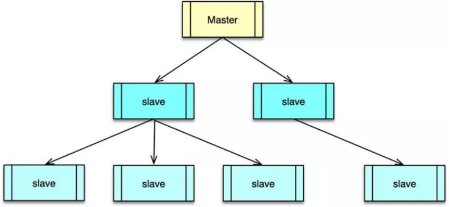
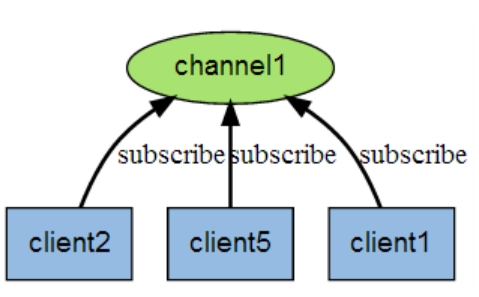

# **redis简介**

非关系型数据库

redis（Remote DIctionary Server）是一个高性能的（Key/Value）分布式内存数据

库，基于内存运行，并支持持久化的NoSQL（非关系型）数据库。

基于内存

因为基于内存，所以它的查询非常快，但是使用时需要权衡内存，数据量不能大于硬件内存。

速度快

Redis采用的是基于内存的采用的是单进程单线程模型的 KV 数据库，由C语言编写，官方提供的数据是可以达到100000+的QPS（每秒内查询次数）。这个数据不比采用单进程多线程的同样基于内存的 KV数据库 Memcached 差。

单线程

因为Redis是基于内存的操作，CPU不是Redis的瓶颈，Redis的瓶颈最有可能是机器内存的大小或者网络带宽。既然单线程容易实现，而且CPU不会成为瓶颈，那就顺理成章地采用单线程的方案了！

# **redis服务器的安装**

因为redis通常部署在Linux机器上，所以我们仅给出Linux环境安装方式。

## **linux原生安装**

官网下载redis.tar.gz，该包解压其实是redis的源码。需要下载gcc编译源码，得到二进制文件。

详细安装过程请网上查找。我们将采用最简单的docker安装方式。

## **docker安装**

docker pull 可以很方便地从仓库拉取一个redis镜像，然后docker run启动即可。详细请参考docker笔记。

## **redis客户端的使用**

如同mysql服务器中的数据库概念一样，redis默认16个数据库，初始默认使用0号库。

我们想使用redis需要借助redis客户端，常见有以下几种redis客户端

### redis-cli

redis-cli是redis安装包自带的redis客户端，也是一个CLI工具。

### **windows GUI客户端**

cli客户端使用起来不是很友好，windows机器上有比较方便的GUI客户端。可以自己尝试查找较为流行的redis GUI客户端，比较容易查看数据。

### **jedis客户端**

我们在代码中连接redis肯定不能用上面两种方式。比如一个javaWeb程序，通常会引入jar包，yml中配置一些信息，连接redis。这种jar包其实也是一种rerdis客户端。

常见的用于连接redis的客户端有jedis、springboot默认的luttuce。

# **5种基本数据类型**

flushdb  该命令可刷新数据库中的数据

## **String**

String是redis最基本的类型，它存储的是key-value键值对。redis的string可以包含任何数据，即使是二进制数据，比如jpg图片或者序列化的对象。一个redis中字符串value最多可以是512M，所以根本不用担心文章太长无法用字符串存储。

之所以称redis是key-value是数据库，因为数据存放在value中，redis都是通过key操作string类型的数据。当我们说使用redis的String类型时，其实value可以存字符串或者数字。

### 增删改查

常用增删改查

```shell
set key1 value1 #设置值

get key1   #获取值

del key1   #删除键值对

keys *    #查看所有的键

exists key1  #确认 key1 是否存在，返回0为不存在

setnx（set if not exist）不存在则设置键值对

setnx mykey "redis" # 如果不存在就设置，成功返回1，已存在返回0
```

同时操作多组键值对

```shell
同时设置一个或多个 key-value 用mset 
mset k10 v10 k11 v11 k12 v12

mget k10 k11 k12 k13 #同时获取多个值

msetnx 同时设置多个不存在的key-value

msetnx k10 v10 k15 v15  #原子性操作，有一个key已存在就失败
```

getset（先get再set）

```shell
getset db mongodb   #没有旧值，返回 nil
```

### 常用函数

获取值的长度

```shell
strlen key1 
```

追加

```shell
append key1 "hello"  #如果key1不存在，创建键值对；存在，在其值后追加字符串。返回值为字符串的长度
```

截取子串

getrange 获取指定区间范围内的值

```shell
set key2 abcd123456 # 设置key2的值

getrange key2 0 -1  # 获得全部的值

getrange key2 0 2  #截取0-2这个长度为3的子串
```

setrange 设置指定区间范围内的值，格式是setrange key值 具体值

### 过期时间

```shell
设置过期时间setex（set with expire）
setex key3 60 expire  # 设置过期时间

查看剩余的时间
ttl key3
```

### 自增操作

String类型的value也可以是数字，使用数字的自增自减来计数很方便

```shell
set views 0  #设置浏览量

incr views  #自增值 +1

decr views  #自减值 -1

incrby views 10  #自增值 +10

decrby views 10  #自减值 -10
```

### 存储对象

\# 传统对象缓存 

set user:1 value(json数据) 

\# 可以用来缓存对象 

mset user:1:name zhangsan user:1:age 2 

mget user:1:name user:1:age

## **List**

当我们说使用redis的List类型时，其实value是一个链表。

List就是链表，略有数据结构知识的人都应该能理解其结构。Redis的list是每个子元素都是String类型的双向链表，可以通过push和pop操作从列表的头部或者尾部操作元素，因此List即可以作为栈，也可以作为队列。Redis还提供了操作List中某一段的api，你可以直接查询，删除List中某一段的元素。

使用Lists结构，我们可以轻松地实现最新消息排行等功能。List的另一个应用就是消息队列，可以利用List的PUSH操作，将任务存在List中，然后工作线程再用POP操作将任务取出进行执行。

```shell
lpush：将一个或多个值插入到列表头部。若无列表，则创建

rpush：将一个或多个值插入到列表尾部。

lpush list "one"

rpush list "right"

 

lrange：返回列表中指定区间内的元素，0表示第一个，-1最后一个

lrange list 0 -1 #返回所有元素

 

lpop 命令用于移除并返回列表的第一个元素。

rpop 移除列表的最后一个元素

lpop list

rpop list

 

lindex按照索引下标获得元素

lindex list 1

 

llen 用于返回列表的长度

llen list

 

lrem

 

ltrim对一个列表进行修剪(trim)，就是说，让列表只保留指定区间内的元素，不在指定区 间之内的元素都将被删除。

ltrim mylist 1 2  #只保留1-2索引之间的元素

 

rpoplpush 移除列表的最后一个元素，并将该元素添加到另一个列表并返回

rpoplpush mylist myotherlist

 

lset list index value将列表list下标为 index 的元素的值设置为 value

lset list 0 "new"

 

linsert key before/after pivot value 在列表中的元素pivot前或者后插入value

linsert mylist BEFORE "World" "There"
```

## **Set（无序集合）**

当我们说使用redis的 Set 类型时，其实value是一个集合。

```shell
sadd 将一个或多个成员元素加入到集合中，不能重复

sadd myset "hello"

 

smembers 返回集合中的所有的成员

smembers myset

 

scard获取集合里面的元素个数

scard myset

 

sismember 命令判断成员元素是否是集合的成员

sismember myset "hello"  #不包含返回0


srem 用于移除集合中的一个或多个成员元素

srem myset "kuangshen"

 

srandmember返回集合中的一个随机元素

srandmember myset 随机返回一个

srandmember myset 2  随机返回2个

 

spop移除集合中的一个随机元素

spop myset

smove set1 destination member将member 元素从 set1移动到 集合destination

smove myset myset2 "kuangshen"
```

### 集合运算

```shell
sdiff 计算两个集合的差集

sinter 计算两个集合的交集

sunion  计算两个集合的并集

sdiff set1 set2 #计算set1和set2的差集
```

在社交应用中，可以将一个用户所有的关注人存在一个集合中，将其所有粉丝存在一个集合。Redis还为集合提供了求交集、并集、差集等操作，可以非常方便的实现如共同关注、共同喜好、二度好友等功能。

## **Hash**

当我们说使用redis的 hash 类型时，其实value是一个哈希表。

redis中hash的用途是什么？

 ```shell
 hset、hget 哈希表中的基本操作
 
 hset myhash field1 "kuangshen"  存一个key-value
 
 hget myhash field1  取值
 
  
 
 hmset、hmget同时将多个key-value对设置到哈希表中，会覆盖老的
 
 hmset myhash field1 "Hello" field2 "World"
 
  
 
 hgetall 返回哈希表中所有的字段和值
 
 hgetall myhash
 
  
 
 hdel 删除哈希表 key 中的一个或多个指定字段
 
 hdel myhash field1
 
  
 
 hlen 获取哈希表中字段的数量
 
 hlen myhash
 
  
 
 hexists 查看哈希表的指定key是否存在
 
 hexists myhash field1
 
 
 hkeys 获取哈希表中的所有域（field）
 
 hvals 返回哈希表所有域(field)的值
 
 hkeys myhash
 
 hvals myhash
 
 
 hsetnx 若哈希表中字段不存在则创建，若存在则不修改并返回0
 
 hsetnx myhash field1 "hello"
 
 
 hincrby 哈希表中的value是数字时，加上指定增量值
 
 hset myhash field 5
 
 hincrby myhash field 1
 
 hincrby myhash field -10
 ```

## **Zset（有序集合）**

当我们说使用redis的 Zset 类型时，其实value是一个有序集合。

set中数据是无序的，zset在set基础上，加一个score值。之前set是set1 v1 v2 v3，现在zset是 set1 score1 v1 score2 v2。有序集成员按score值递增排列。

和set相比，sorted set增加了一个权重参数score，使得集合中的元素能够按score进行有序排列，比如一个存储全班同学成绩的sorted set，其集合value可以是同学的学号，而score就可以是其考试得分，这样在数据插入集合的时候，就已经进行了天然的排序。可以用sorted set来做带权重的队列，比如普通消息的score为1，重要消息的score为2，然后工作线程可以选择按score的倒序来获取工作任务，让重要的任务优先执行。

```shell
zadd 将一个或多个元素及其分数值加入到有序集当中

zadd myset 1 "one"

zadd myset 2 "two" 3 "three"

 

zrange 返回有序集中，指定index区间内的元素

zrange myset 0 -1

 

zrangebyscore 返回有序集中指定score区间的成员列表。

zrangebyscore salary -inf +inf 从负无穷到正无穷内的元素，即查询所有元素

zrangebyscore salary -inf +inf withscores  带分数显示元素

zrangebyscore salary -inf 2500 withscores  显示小于2500的元素


zrank 返回有序集中指定成员的排名

zrank salary kuangshen


zrevrange递减返回zset中指定区间的元素

zrevrange salary 0 -1 withscores  递减排列


zrevrank 返回有序集中成员的排名（从大到小）

zrevrank salary xiaohong


zrem 移除有序集中的一个或多个成员

zrem salary kuangshen


zcard 命令用于计算集合中元素的数量

zcard salary

zcount 计算有序集合中指定分数区间的成员数量

zadd myset 2 "world" 3 "kuangshen"
```


# **进阶数据结构**

 

# **redis主从复制与哨兵模式**

## **主从复制**

主从复制是指将一台Redis服务器的数据，复制到其他的Redis服务器。前者称为主节点(master/leader)，后者称为从节点(slave/follower)。数据的复制是单向的，只能由主节点到从节点。

默认情况下，每台Redis服务器都是主节点，且一个主节点可以有多个从节点(或没有从节点)，但一个从节点只能有一个主节点。通常master以写为主，slave 以读为主。

 

要将Redis运用于工程项目中，只使用一台Redis是万万不能的，因为单个Redis服务器会发生单点故障，并且一台服务器需要处理所有的请求负载，压力较大；一般来说，不能将所有内存用作Redis存储内存，单台Redis最大使用内存不应该超过20G。

 

采用redis主从复制有以下几种好处

1、数据冗余：主从复制实现了数据的热备份，是持久化之外的一种数据冗余方式。

这么看数据冗余并不总是坏的，占用空间的。数据冗余是一种防数据丢失的办法。

2、故障恢复：当主节点出现问题时，可以由从节点提供服务，实现快速的故障恢复；实际上是一种服务

的冗余。

3、负载均衡：在主从复制的基础上，配合读写分离，可以由主节点提供写服务，由从节点提供读服务

（即写Redis数据时应用连接主节点，读Redis数据时应用连接从节点），分担服务器负载；尤其是在写

少读多的场景下，通过多个从节点分担读负载，可以大大提高Redis服务器的并发量。

4、高可用基石：除了上述作用以外，主从复制还是哨兵和集群能够实施的基础，因此说主从复制是

Redis高可用的基础。

### 搭建主从复制

配置主从复制，一般至少需要三个，一主二从。

下文中配置redis哨兵模式，会包含主从复制的配置，参考下文即可。

## **哨兵模式**

主从切换技术的方法是：当主服务器宕机后，需要手动把一台从服务器切换为主服务器，这就需要人工干预，费事费力，还会造成一段时间内服务不可用。这不是一种推荐的方式，更多时候，我们优先考虑哨兵模式。

Redis从2.8开始正式提供了Sentinel（哨兵） 架构来解决这个问题。其原理是哨兵通过发送命令，等待Redis服务器响应，从而监控运行的多个Redis实例。哨兵是一个独立的进程，作为进程，它会独立运行。

### **哨兵的工作原理**

哨兵有以下两个作用

1)通过发送命令，让Redis服务器返回监控其运行状态，包括主服务器和从服务器。

2)当哨兵监测到master宕机，会自动将slave切换成master，然后通过发布订阅模式通知其他的从服务器，修改配置文件，让它们切换主机。

 

然而一个哨兵进程对Redis服务器进行监控，可能会出现问题，为此，我们可以使用多个哨兵进行监控。各个哨兵之间还会进行监控，这样就形成了多哨兵模式。

 

假设主服务器宕机，哨兵1先检测到这个结果，系统并不会马上进行failover过程，仅仅是哨兵1主观的认为主服务器不可用，这个现象成为主观下线。当后面的哨兵也检测到主服务器不可用，并且数量达到一定值时，那么哨兵之间就会进行一次投票，投票的结果由一个哨兵发起，进行failover[故障转移]操作。切换成功后，就会通过发布订阅模式，让各个哨兵把自己监控的从服务器实现切换主机，这个过程称为客观下线。

### 搭建哨兵模式

 

# **发布订阅**

Redis 发布订阅 (pub/sub) 是一种消息通信模式：发送者 (pub) 发送消息，订阅者 (sub) 接收消息。这里的发送者和订阅者都是redis客户端，实现发布订阅仍需要启动redis服务端。类似微信，用户A和B之间可以互发消息，A和B就是客户端，但仍需要腾讯提供微信服务器。

 

Redis 通过 PUBLISH、SUBSCRIBE和PSUBSCRIBE 等命令实现发布和订阅功能。

通过 SUBSCRIBE 命令订阅某频道后，redis-server 里维护了一个字典，字典的键就是一个个 channel，而字典的值则是一个链表，链表中保存了所有订阅这个 channel 的客户端。SUBSCRIBE 命令的关键，就是将客户端添加到给定 channel 的订阅链表中。

通过 PUBLISH 命令向订阅者发送消息，redis-server 会使用给定的频道作为键，在它所维护的 channel字典中查找记录了订阅这个频道的所有客户端的链表，遍历这个链表，将消息发布给所有订阅者。

Pub/Sub 从字面上理解就是发布（Publish）与订阅（Subscribe），在Redis中，你可以设定对某一个key值进行消息发布及消息订阅，当一个key值上进行了消息发布后，所有订阅它的客户端都会收到相应的消息。这一功能最明显的用法就是用作实时消息系统，比如普通的即时聊天，群聊等功能。

## **常用发布订阅命令**

```shell
#订阅给定的一个或多个频道的信息
SUBSCRIBE channel channel2 ... 

#将信息发送到指定的频道
PUBLISH channel message

#订阅一个或多个符合给定模式的频道
PSUBSCRIBE pattern pattern2 ...

#指退订给定的频道
UNSUBSCRIBE channel channel2 ...
 
#退订所有给定模式的频道
PUNSUBSCRIBE pattern pattern2 ...

#查看订阅与发布系统状态，该命令具体使用请查其他资料
PUBSUB subcommand [argument [argument ...]]
```

## **实例演示**

必须得先订阅，才能收到发布者发布的消息。

第一个 redis-cli 客户端（订阅者）

```shell
redis 127.0.0.1:6379> SUBSCRIBE runoobChat

Reading messages... (press Ctrl-C to quit)
1) "subscribe"
2) "runoobChat"
3) (integer) 1
```

第二个 redis-cli 客户端（发布者）

```shell
redis 127.0.0.1:6379> PUBLISH runoobChat "Redis PUBLISH test"
(integer) 1
redis 127.0.0.1:6379> PUBLISH runoobChat "Learn redis by runoob.com"
(integer) 1
```

订阅者的客户端会显示如下消息
```shell
1) "message"
2) "runoobChat"
3) "Redis PUBLISH test"
1) "message"
2) "runoobChat"
3) "Learn redis by runoob.com"
```

# **redis事务**

或许这个世界上的数据库系统千差万别，但在事务处理这个问题上它们最终会殊途同归，就像解决并发过程中的冲突问题，常规的做法依然是加锁一样，这是我之所以要花费精力去理解和解释这些理论知识的原因。redis的事务与关系型数据库，如mysql如出一辙。技术可谓是日新月异，如果我们总是一味地为新技术而疲于奔命，那么或许我们会渐渐地失去对这个行业的热爱，切记原理永远比框架更为重要。

## **redis事务特点**

事务的本质是一组命令的集合，事务支持一次执行多个命令。Redis中的事务是可以视为一个队列，即我们可以通过MULTI开始一个事务，这相当于我们声明了一个命令队列。接下来，我们向Redis中提交的每条命令，都会被排入这个命令队列。当我们输入EXEC命令时，将触发当前事务，这相当于我们从命令队列中取出命令并执行，所以Redis中一个事务从开始到执行会经历开始事务 、 命令入队 和 执行事务 三个阶段。

Redis事务没有隔离级别的概念：

批量操作在发送 EXEC 命令前被放入队列缓存，并不会被实际执行！

Redis不保证原子性：

Redis中，单条命令是原子性执行的，但事务不保证原子性，且没有回滚。事务中任意命令执行失败，其余的命令仍会被执行。

## redis事务相关命令

- multi # 标记一个事务块的开始，会将后续提交的命令加入队列（ queued） 

- exec # 执行所有事务块的命令 （ 一旦执行exec后，之前加的监控锁都会被取消掉 ） 

- discard # 取消事务，事务块中的所有命令都不会执行

- watch key1 key2 ... #监视一或多个key,如果在事务执行之前，被监视的key被其他命令改动，则 

事务被打断 （ 类似乐观锁 ）

unwatch # 取消watch对所有key的监控 

### 执行事务

```shell
>>multi

>>set user1 wendy

>>set user2 dandan

>>exec
```

### 放弃事务

 ```shell
 >>multi
 
 >>set user1 wendy
 
 >>set user2 dandan
 
 >>discard
 ```

### 事务执行异常情况

语法错误

若在事务队列中存在命令使用错误（类似于java编译性错误），则执行EXEC命令时，所有命令都不会执行。比如下面事务不会执行。

```shell
>>multi

>>set user1 wendy

>>set user2 dandan

>>getset user1  //命令不是这样用的

>>exec
```

运行时异常

若在事务队列中存在无法执行的语句（类似于java的1/0的运行时异常），则执行EXEC命令时，其他正确命令会被执行，错误命令抛出异常。

```shell
>>multi

>>set user1 wendy

>>set user2 dandan

>>incr user1 //user1不是数字，不能自增，运行时异常

>>exec
```

## **锁**

悲观锁：

悲观锁(Pessimistic Lock),顾名思义，就是很悲观，每次去拿数据的时候都认为别人会修改，所以每次在拿数据的时候都会上锁，这样别人想拿到这个数据就会block直到它拿到锁。传统的关系型数据库里面就用到了很多这种锁机制，比如行锁，表锁等，读锁，写锁等，都是在操作之前先上锁。

乐观锁：

乐观锁(Optimistic Lock),顾名思义，就是很乐观，每次去拿数据的时候都认为别人不会修改，所以不会上锁。但是在更新的时候会判断一下再此期间别人有没有去更新这个数据，可以使用版本号等机制，乐观锁适用于多读的应用类型，这样可以提高吞吐量，乐观锁策略：提交版本必须大于记录当前版本才能执行更新。

watch可以给变量加乐观锁，使用watch监测balance，事务执行期间，如果发现balance变动，事务执行失败！

\# 窗口一 

```shell
127.0.0.1:6379> watch balance 
OK
127.0.0.1:6379> MULTI # 执行完毕后，执行窗口二代码测试 
OK
127.0.0.1:6379> decrby balance 20 
QUEUED 
127.0.0.1:6379> incrby debt 20 
QUEUED 
127.0.0.1:6379> exec # 修改失败！ 
(nil) 
```

\# 窗口二 

```shell
127.0.0.1:6379> get balance 
"80" 
127.0.0.1:6379> set balance 200 
OK
```

注意：一但执行 EXEC 开启事务的执行后，无论事务使用执行成功， WARCH 对变量的监控都将被取消。故当事务执行失败后，需重新执行WATCH命令对变量进行监控，并开启新的事务进行操作。

# **redis的持久化**

Redis 是内存数据库，如果不将内存中的数据库状态保存到磁盘，那么一旦服务器进程退出，服务器中的数据库状态也会消失。 Redis 提供了两种持久化方式，分别是RDB和AOF。

## **RDB**

在指定的时间间隔内将内存中的数据快照(Snapshot)写入磁盘，恢复时是将快照文件直接读到内存里。

Redis会单独创建（fork）一个子进程来进行持久化，会先将数据写入到一个临时文件中，待持久化过程都结束了，再用这个临时文件替换上次持久化好的文件。整个过程中，主进程是不进行任何IO操作的，这就确保了极高的性能。如果需要进行大规模数据的恢复，且对于数据恢复的完整性不是非常敏感，那RDB方式要比AOF方式更加的高效。

RDB是默认的持久化方式，这种方式是就是将内存中数据以快照的方式写入到二进制文件中,默认的文件名为dump.rdb。

### **RDB触发方式**

既然RDB机制是通过把某个时刻的所有数据生成一个快照来保存，那么就应该有一种触发机制，是实现这个过程。对于RDB来说，提供了三种机制：save、bgsave、自动化。

#### 1.save触发方式

该命令会阻塞当前Redis服务器，执行save命令期间，Redis不能处理其他命令，直到RDB过程完成为止。具体流程如下：

 

执行完成时候如果存在老的RDB文件，就把新的替代掉旧的。我们的客户端可能都是几万或者是几十万，这种方式显然不可取。

#### 2.bgsave触发方式

执行该命令时，Redis会在后台异步进行快照操作，快照同时还可以响应客户端请求。具体流程如下：

 

具体操作是Redis进程执行fork操作创建子进程，RDB持久化过程由子进程负责，完成后自动结束。阻塞只发生在fork阶段，一般时间很短。基本上 Redis 内部所有的RDB操作都是采用 bgsave 命令。

 

#### 3.自动触发

自动触发是由我们的配置文件来完成的。在redis.conf配置文件中，里面有如下配置，我们可以去设置：

①save：这里是用来配置触发 Redis的 RDB 持久化条件，也就是什么时候将内存中的数据保存到硬盘。比如“save m n”。表示m秒内数据集存在n次修改时，自动触发bgsave。

\#表示900 秒内如果至少有 1 个 key 的值变化，则保存save 900 1

\#表示300 秒内如果至少有 10 个 key 的值变化，则保存save 300 10

\#表示60 秒内如果至少有 10000 个 key 的值变化，则保存save 60 10000

不需要持久化，那么你可以注释掉所有的 save 行来停用保存功能。

②stop-writes-on-bgsave-error ：默认值为yes。当启用了RDB且最后一次后台保存数据失败，Redis是否停止接收数据。这会让用户意识到数据没有正确持久化到磁盘上，否则没有人会注意到灾难（disaster）发生了。如果Redis重启了，那么又可以重新开始接收数据了

③rdbcompression ；默认值是yes。对于存储到磁盘中的快照，可以设置是否进行压缩存储。

④rdbchecksum ：默认值是yes。在存储快照后，我们还可以让redis使用CRC64算法来进行数据校验，但是这样做会增加大约10%的性能消耗，如果希望获取到最大的性能提升，可以关闭此功能。

⑤dbfilename ：设置快照的文件名，默认是 dump.rdb

⑥dir：设置快照文件的存放路径，这个配置项一定是个目录，而不能是文件名。

### **RDB 的优势和劣势**

①、优势

- （1）RDB文件紧凑，全量备份，非常适合用于进行备份和灾难恢复。

- （2）生成RDB文件的时候，redis主进程会fork()一个子进程来处理所有保存工作，主进程不需要进行任何磁盘IO操作。

- （3）RDB 在恢复大数据集时的速度比 AOF 的恢复速度要快。

②、劣势

（1）RDB快照是一次全量备份，存储的是内存数据的二进制序列化形式，存储上非常紧凑。当进行快照持久化时，会开启一个子进程专门负责快照持久化，子进程会拥有父进程的内存数据，父进程修改内存子进程不会反应出来，所以在快照持久化期间修改的数据不会被保存，可能丢失数据。

## **AOF**

全称Append Only File，以日志的形式来记录每个写操作，将Redis执行过的所有指令记录下来（读操作不记录），只许追加文件但不可以改写文件已有内容。redis重启的话就根据日志文件的内容将写指令从前到后执行一次以完成数据的恢复工作。

 

 

### **日志文件重写**

AOF的方式也同时带来了另一个问题。持久化文件会变的越来越大。为了压缩aof的持久化文件。redis提供了bgrewriteaof命令。将内存中的数据以命令的方式保存到临时文件中，同时会fork出一条新进程来将文件重写。

 

重写aof文件的操作，并没有读取旧的aof文件，而是将整个内存中的数据库内容用命令的方式重写了一个新的aof文件，这点和快照有点类似。

### **AOF触发机制**

（1）always：同步持久化 每次发生数据变更会被立即记录到磁盘 性能较差但数据完整性比较好

（2）everysec：异步操作，每秒记录 如果一秒内宕机，有数据丢失

（3）no：从不同步

### **AOF优势与劣势**

优点

（1）AOF可以更好的保护数据不丢失，一般AOF会每隔1秒，通过一个后台线程执行一次fsync操作，最多丢失1秒钟的数据。

（2）AOF日志文件没有任何磁盘寻址的开销，写入性能非常高，文件不容易破损。

（3）AOF日志文件即使过大的时候，出现后台重写操作，也不会影响客户端的读写。

（4）AOF日志文件的命令通过非常可读的方式进行记录，这个特性非常适合做灾难性的误删除的紧急恢复。比如某人不小心用flushall命令清空了所有数据，只要这个时候后台rewrite还没有发生，那么就可以立即拷贝AOF文件，将最后一条flushall命令给删了，然后再将该AOF文件放回去，就可以通过恢复机制，自动恢复所有数据

缺点

（1）对于同一份数据来说，AOF日志文件通常比RDB数据快照文件更大

（2）AOF开启后，支持的写QPS会比RDB支持的写QPS低，因为AOF一般会配置成每秒fsync一次日志文件，当然，每秒一次fsync，性能也还是很高的

## **持久化选择**

选择的话，两者加一起才更好。因为两个持久化机制你明白了，剩下的就是看自己的需求了，需求不同选择的也不一定，但是通常都是结合使用。

如果同时开启两种持久化方式，在这种情况下，当redis重启的时候会优先载入AOF文件来恢复原始的数据，因为在通常情况下AOF文件保存的数据集要比RDB文件保存的数据集要完整。但RDB 的数据不实时，同时使用两者时服务器重启也只会找AOF文件。

那要不要只使用AOF呢？作者建议不要，因为RDB更适合用于备份数据库（AOF在不断变化不好备份），快速重启，而且不会有AOF可能潜在的Bug，留着作为一个备用的手段。

# **缓存穿透与雪崩**

redis常作为web系统中的缓存，来看看缓存的处理流程。

前台请求，后台先从缓存中取数据，取到直接返回结果，取不到时从数据库中取，数据库取到更新缓存，并返回结果，数据库也没取到，那直接返回空结果。 

 

 

## **缓存穿透**

缓存穿透是指缓存和数据库中都没有的数据，而很多用户不断发起请求，缓存都没有命中，于是都去请求了持久层数据库。这会给持久层数据库造成很大的压力，此时相当于出现了缓存穿透。如请求id为“-1”的数据或id为不存在的数据。这时的用户很可能是攻击者，会导致数据库压力过大。

### **解决方案**

参数校验

如白名单，对所有可能查询的参数以hash形式存储，在控制层先进行校验，不符合则丢弃，从而避免了对底层存储系统的查询压力

如接口层制定鉴权规则，对请求参数校验，如用户鉴权校验、id校验

缓存空对象

当存储层不命中后，即使返回的空对象也将其缓存起来，即将key-value对写为key:null。同时有效时间可以设置短点，如30秒（设置太长会导致正常情况也没法使用）。之后再访问这个数据将会从缓存中获取，保护了后端数据源；

## **缓存击穿**

缓存击穿场景中的key通常是热点数据，有大量的请求并发访问，由于缓存过期，读缓存没读到，并发访问会同时访问数据库来查询数据，会导使数据库瞬间压力过大。

注意缓存击穿通常是大并发情况大致的，只需一个热点key过期，就会导致缓存击穿。而下面的缓存雪崩，通常是大量key同时到期导致的。

### **解决方案**

设置热点数据永不过期

从缓存层面来看，设置热点数据永不过期，便不会出现热点 key 过期后产生的问题。此时也要考虑定时刷新缓存中的热点数据，保持缓存与数据库数据的一致性。

加互斥锁

 

说明：

1）缓存中有数据，直接走上述代码13行后就返回结果了

2）缓存中没有数据，第1个进入的线程，获取锁并从数据库去取数据，没释放锁之前，其他并行进入的线程会等待100ms，再重新去缓存取数据。这样就防止都去数据库重复取数据，重复往缓存中更新数据情况出现。

3）当然这是简化处理，理论上如果能根据key值加锁就更好了，就是线程A从数据库取key1的数据并不妨碍线程B取key2的数据，上面代码明显做不到这点。

## **缓存雪崩**

缓存雪崩是指缓存中数据大批量到过期时间，而查询数据量巨大，引起数据库压力过大甚至down机。和缓存击穿不同的是，缓存击穿指并发查同一条数据，缓存雪崩是不同数据都过期了，很多数据都查不到从而查数据库。

比如马上到双11零点，很快就会迎来一波抢购，这波商品时间比较集中的放入了缓存，假设缓存一个小时。那么到了凌晨一点钟的时候，这批商品的缓存就都过期了。而对这批商品的访问查询，都落到了数据库上，对于数据库而言，就会产生周期性的压力波峰。于是所有的请求都会达到存储层，存储层的调用量会暴增，造成存储层也会挂掉的情况。

### **解决方案**

其实集中过期，倒不是非常致命，比较致命的缓存雪崩，是缓存服务器某个节点宕机或断网。因为自然形成的缓存雪崩，一定是在某个时间段集中创建缓存，集中创建缓存时数据库可以顶住压力，同时过期按理来说再集中创建一次也是顶得住的，无非就是对数据库产生周期性的压力而已。而缓存服务节点的宕机，对数据库服务器造成的压力是不可预知的，很有可能瞬间就把数据库压垮。有以下几种解决方式：

#### 事前解决

在缓存雪崩之前有以前几种预防措施

1.缓存高可用

既然redis有可能挂掉，使用redis集群，这样一台挂掉之后其他的还可以继续工作，这就是redis的高可用

2.数据预热设置不同的过期时间

数据加热的含义就是在正式部署之前，我先把可能的数据先预先访问一遍，这样部分可能大量访问的数据就会加载到缓存中。在即将发生大并发访问前手动触发加载缓存不同的key，设置不同的过期时间，让缓存失效的时间点尽量均匀。

3.设置热点数据不过期

同缓存击穿中的一样

#### 事中解决

如果已经发生缓存雪崩，上面几种预防式的解决方式不再使用。我们可以限流降级。

限流降级

如果已经发生缓存雪崩，上面几种预防式的解决方式不再使用。此时可以使用ehcache本地缓存 + Hystrix限流&降级,避免MySQL被打死。

使用 ehcache 本地缓存的目的也是考虑在 Redis Cluster 完全不可用的时候，ehcache 本地缓存还能够支撑一阵。

使用 Hystrix进行限流 & 降级 ，比如一秒来了5000个请求，我们可以设置假设只能有一秒 2000个请求能通过这个组件，那么其他剩余的 3000 请求就会走限流逻辑。

然后去调用我们自己开发的降级组件（降级），比如设置的一些默认值呀之类的。以此来保护最后的 MySQL 不会被大量的请求给打死。

#### 事后解决

开启Redis持久化机制，缓存雪崩后，尽快恢复缓存集群

一旦重启，就能从磁盘上自动加载数据恢复内存中的数据。

# Java集成redis

lettuce 和 jedis 的定位都是 java 使用Redis的client，所以他们当然可以直接连接redis server。也就是说这两种都可以用作redis的客户端。

Jedis在实现上是直接连接的redis server，如果在多线程环境下是非线程安全的，这个时候只有使用连接池，为每个Jedis实例增加物理连接。

Lettuce的连接是基于Netty的，连接实例（StatefulRedisConnection）可以在多个线程间并发访问，应为StatefulRedisConnection是线程安全的，所以一个连接实例（StatefulRedisConnection）就可以满足多线程环境下的并发访问，当然这个也是可伸缩的设计，一个连接实例不够的情况也可以按需增加连接实例。

lettuce主要利用netty实现与redis的同步和异步通信。

## **lettuce**

springboot默认采用lettuce

```xml
<dependency>
   <groupId>org.springframework.boot</groupId>
   <artifactId>spring-boot-starter-data-redis</artifactId>
</dependency>
```

## **jedis**

在springboot2.X版本后,默认使用的的redis客户端是Lettuce,如果项目中想要使用jedis,需要先把Lettuce依赖去掉。

```xml
<dependency>
    <groupId>org.springframework.boot</groupId>
    <artifactId>spring-boot-starter-data-redis</artifactId>
    <!-- 如果使用jedis,则去掉默认的lettuce,再引入redis client-->
    <exclusions>
        <exclusion>
            <groupId>io.lettuce</groupId>
            <artifactId>lettuce-core</artifactId>
        </exclusion>
    </exclusions>
</dependency>
<dependency>
    <groupId>redis.clients</groupId>
    <artifactId>jedis</artifactId>
    <version>3.3.0</version>
</dependency>
```

# **redis分布式锁**

 