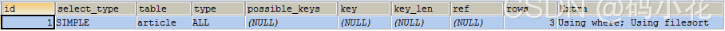
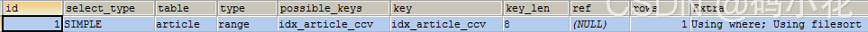
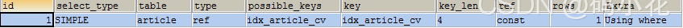

[toc]

#  MySQL索引介绍

## 概念

MySQL官方对索引的定义为：索引（Index）是帮助MySQL高效获取数据的数据结构。可以得到索引的本质：索引是排好序的快速查找数据结构。一般来说索引本身也很大，不可能全部存储在内存中，因此索引往往以索引文件的形式存储在磁盘上。

## 优劣

索引并不是”银弹“。

### 优势

所有的MySql列类型(字段类型)都可以被索引，也就是可以给任意字段设置索引。
大大加快数据的查询速度。       
提高数据检索的效率，降低数据排序的成本

### 劣势

实际上索引也是一张表，该表保存了主键与索引字段，并指向实体表的记录，所以索引列也是要占用空间的。
虽然索引大大提高了查询速度，同时却会降低更新表的速度，如对表进行INSERT、UPDATE和DELETE。因为更新表时，MySQL不仅要保存数据，还要保存一下索引文件每次更新添加了索引列的字段，都会调整因为更新所带来的键值变化后的索引信息。
索引只是提高效率的一个因素，如果你的MySQL有大数据量的表，就需要花时间研究建立最优秀的索引，或者优化查询。

## 使用原则

对经常更新的表就避免对其设置过多的索引，对经常用于查询的字段应该创建索引。
数据量小的表最好不要使用索引，因为由于数据较少，可能查询全部数据花费的时间比遍历索引的时间还要短，索引就可能不会产生优化效果。
在一个列上(字段上)不同值较少的不要建立索引，比如在学生表的"性别"字段上只有男，女两个不同值。相反的，在一个字段上不同值较多的可是建立索引。

下面是更详细使用索引的指导

### 哪些情况需要创建索引

- 主键自动建立唯一索引
- 频繁作为查询条件的字段应该创建索引
- 查询中与其它表关联的字段，外键关系建立索引
- 频繁更新的字段不适合创建索引，因为每次更新不单单是更新了记录，还会更新索引，加重IO负担
- where条件里用不到的字段不创建索引
- 单键/组合索引的选择问题，who？（在高并发下倾向创建组合索引）
- 查询中排序的字段，排序字段若通过索引去访问将大大提高排序速度
- 查询中统计或者分组字段

### 哪些情况不需要创建索引

- 表记录太少
- 经常增删改的表：虽然提高了查询速度，同时却会降低更新表的速度，如对表进行INSERT、UPDATE和DELETE。因为更新表时，MySQL不仅要保存数据，还要保存一下索引文件。
- 数据重复且分布平均的表字段，因此应该只为最经常查询和最经常排序的数据列建立索引。注意，如果某个数据列包含许多重复的内容，为它建立索引就没有太大的实际效果。

# 索引分类与创建

MySQL中分为：普通索引，唯一索引，[主键](https://so.csdn.net/so/search?q=主键&spm=1001.2101.3001.7020)索引，组合索引，和全文索引。

## 普通索引

是最基本的索引，它没有任何限制，允许在定义索引的列中插入重复值和空值，纯粹为了查询数据更快一点。。它有以下几种创建方式：

```mysql
# 1.直接创建索引
CREATE INDEX index_name ON table(column(length))
 
# 2.修改表结构的方式添加索引
ALTER TABLE table_name ADD INDEX index_name ON (column(length))
 
# 3.创建表的时候同时创建索引
CREATE TABLE `table` (
    `id` int(11) NOT NULL AUTO_INCREMENT ,
    `title` char(255) CHARACTER NOT NULL ,
    `content` text CHARACTER NULL ,
    `time` int(10) NULL DEFAULT NULL ,
    PRIMARY KEY (`id`),
    INDEX index_name (title(length))
)
 
# 4.删除索引
DROP INDEX index_name ON table
```

## 唯一索引

与前面的普通索引类似，不同的就是：索引列的值必须唯一，但允许有空值。如果是组合索引，则列值的组合必须唯一。它有以下几种创建方式：

```mysql
# 1.创建唯一索引
CREATE UNIQUE INDEX indexName ON table(column(length))
 
# 2.修改表结构
ALTER TABLE table_name ADD UNIQUE indexName ON (column(length))
 
# 3.创建表的时候直接指定
CREATE TABLE `table` (
    `id` int(11) NOT NULL AUTO_INCREMENT ,
    `title` char(255) CHARACTER NOT NULL ,
    `content` text CHARACTER NULL ,
    `time` int(10) NULL DEFAULT NULL ,
     UNIQUE indexName (title(length))
);
```

唯一索引和主键索引唯一的区别：主键索引不能为null

## 主键索引

是一种特殊的唯一索引，一个表只能有一个主键，不允许有空值。一般是在建表的时候同时创建主键索引：

```mysql
CREATE TABLE `table` (
    `id` int(11) NOT NULL AUTO_INCREMENT ,
    `title` char(255) NOT NULL ,
     PRIMARY KEY (`id`)
);
```

## 组合索引

指多个字段上创建的索引，只有在查询条件中使用了创建索引时的第一个字段，索引才会被使用。使用组合索引时遵循最左前缀集合

```mysql
#添加组合索引
ALTER TABLE `table` ADD INDEX name_city_age (id,name,age); 
 
#创建组合索引
CREATE TABLE tab3(
    id INT(4) NOT NULL,
    name CHAR(20) NOT NULL,
    age INT(3) NOT NULL,
    info VARCHAR(255),
    INDEX multiIdx(id,name,age)
);
```

### 最左前缀

组合索引遵从了最左前缀，利用索引中最左边的列集来匹配行，这样的列集称为最左前缀。例如，这里由id、name和age3个字段构成的索引，索引行中就按id/name/age的顺序存放，索引组合中的字段可以是(id，name，age)、(id，name)或者(id)。如果要查询的字段不构成最左面的前缀原则，那么就不会用索引，比如，age或者（name，age）组合就不会使用索引查询。

##  全文索引

主要用来查找文本中的关键字，而不是直接与索引中的值相比较。fulltext索引跟其它索引大不相同，它更像是一个搜索引擎，而不是简单的where语句的参数匹配。fulltext索引配合match against操作使用，而不是一般的where语句加like。

值得一提的是，在数据量较大时候，先将数据放入一个没有全局索引的表中，然后再用CREATE index创建fulltext索引，要比先为一张表建立fulltext然后再将数据写入的速度快很多。这意味着全文索引很影响数据的写入。

注意：innodb存储引擎在mysql 5.6以后才支持全文索引。

### 创建全文索引

全文索引可以在create table，alter table ，create index时建立，不过目前只有char、varchar，text 列上可以创建全文索引。

```mysql
# 1.创建表的适合添加全文索引
CREATE TABLE `table` (
    `id` int(11) NOT NULL AUTO_INCREMENT ,
    `title` char(255) CHARACTER NOT NULL ,
    `content` text CHARACTER NULL ,
    `time` int(10) NULL DEFAULT NULL ,
    PRIMARY KEY (`id`),
    FULLTEXT (content)
);
 
# 2.修改表结构添加全文索引
ALTER TABLE article ADD FULLTEXT index_content(content)
 
# 3.直接创建索引
CREATE FULLTEXT INDEX index_content ON article(content)
```

### 全文检索模式

常用的全文检索模式有两种：

1、自然语言模式(NATURAL LANGUAGE MODE) ， 自然语言模式是MySQL 默认的全文检索模式。自然语言模式不能使用操作符，不能指定关键词必须出现或者必须不能出现等复杂查询。

2、BOOLEAN模式(BOOLEAN MODE) BOOLEAN模式可以使用操作符，可以支持指定关键词必须出现或者必须不能出现或者关键词的权重高还是低等复杂查询。

### 使用例子

在假设我们现在有一章文章表，可以在文章的标题和内容上建立全文索引

```mysql
CREATE TABLE articles (
    id INT UNSIGNED AUTO_INCREMENT NOT NULL PRIMARY KEY,
    title VARCHAR (200),
    body TEXT,
    FULLTEXT (title, body) WITH PARSER ngram
) ENGINE = INNODB;
```

假设我们要从文章标题或内容汇总查找特定关键词，可以使用 match against命令，如下

```mysql
SELECT * FROM articles
WHERE MATCH (title,body)
AGAINST ('一路 一带' IN NATURAL LANGUAGE MODE);

// 不指定模式，默认使用自然语言模式
SELECT * FROM articles
WHERE MATCH (title,body)
AGAINST ('一路 一带');
```

# 单表索引优化案例分析

```mysql
#创建表的SQL语句
CREATE TABLE article(
	id INT UNSIGNED NOT NULL PRIMARY KEY AUTO_INCREMENT,
	author_id INT(10) UNSIGNED NOT NULL,
	category_id INT(10) UNSIGNED NOT NULL,
	views INT(10) UNSIGNED NOT NULL,
	comments INT(10) UNSIGNED NOT NULL,
	title VARBINARY(255) NOT NULL,
	content TEXT NOT NULL
);
 
INSERT INTO article(author_id,category_id,views,comments,title,content) 
VALUES(1,1,1,1,'1','1'),(2,2,2,2,'2','2'),(3,3,3,3,'3','3');
```

在没有创建索引的时候，使用explain查看执行计划

```mysql
# 查询category_id=1 且comments>1的情况下，views最多的article_id
EXPLAIN 
SELECT id,author_id 
FROM article 
WHERE category_id=1 
AND comments>1 
ORDER BY views DESC 
LIMIT 1;
```

结论：type是ALL，最坏的情况，extra中出现了using filesort，也是最坏的情况，必须进行优化



```mysql
#开始优化
#创建索引
#alter table article add index idx_article_ccv(category_id,comments,views);
CREATE INDEX idx_article_ccv ON article(category_id,comments,views);
 
#第二次explain
EXPLAIN 
SELECT id,author_id 
FROM article 
WHERE category_id=1 
AND comments>1 
ORDER BY views DESC 
LIMIT 1;
```



type变成了range，这是可以忍受的，但是extra里using filesort是无法接受的。但是已经创建了索引，为什么没有用？因为按照Btree索引的工作原理，先降序category_id，如果遇到相同的category_id，再排序comments，如果遇到相同的comments，再排序views。当comments字段在联合索引中处于中间位置时，因comments>1条件是一个范围值，故MySQL无法利用索引再对后面的views部分进行检索，即range类型查询字段后面的索引无效。
```mysql
#删除第一次创建的索引
DROP INDEX idx_article_ccv ON article;
 
#第2次新建索引
CREATE INDEX idx_article_cv ON article(category_id,views);
 
#第3次explain
EXPLAIN 
SELECT id,author_id 
FROM article 
WHERE category_id=1 
AND comments>1 
ORDER BY views DESC 
LIMIT 1;
```



 结论：type变成ref，extra中的using filesort也消失了，结果非常理想。

# Expalin分析sql查询

```mysql
EXPLAIN SELECT * FROM (SELECT * FROM uchome_space LIMIT 10) AS s
```

它的执行结果


**1-id**

select查询的序列号，包含一组数字，表示查询中执行select子句或操作表的顺序

- id相同，执行顺序由上至下
- id不同，如果是子查询，id的序号会递增，id值越大优先级越高，越先被执行
- id相同不同，同时存在

**2-select_type**

查询的类型，主要是用于区别普通查询、联合查询、子查询等

- SIMPLE：简单的select查询，查询中不包含子查询或者UNION。
- PRIMARY：查询中包含任何复杂的子部分，最外层查询则被标记为PRIMARY。
- SUBQUERY：包含在select中的子查询，但又不在from的子句中，会被标记为SUBQUERY。
- DERIVED：在FROM列表中包含的子查询被标记为DERIVED（衍生），如上图结果。。MySQL会递归执行这些子查询，把结果放在临时表里。
- UNION：若第二个SELECT出现在UNION之后，则被标记为UNION；若UNION包含在FROM子句的子查询中，外层SELECT将被标记为：DERIVED。
- UNION RESULT：从UNION表中获取结果的SELECT。

**3-table**

输出的行所用的表，这个参数显而易见，容易理解

**4-partitions**

查询将匹配记录的分区。 对于非分区表，该值为 NULL。

**5-type**

显示的是访问类型，是衡量查询效率较为重要的一个指标。

结果值从最好到最坏依次是：system>const>eq_ref>ref>range>index>All

- system：表只有一行记录（等于系统表），这是const类型的特例，平时不会出现，这个也可以忽略不计。
- const：表示通过索引一次就找到了，const用于比较primary key或则unique索引。因为只匹配一行数据，所以很快。如将主键置于where列表中，MySQL就能将该查询转换为一个常量。
- eq_ref：唯一性索引扫描，对于每个索引键，表中只有一条记录与之匹配。常见于主键或唯一索引扫描。
- ref：非唯一性索引扫描，返回匹配某个单独值的所有行。本质上也是一种索引访问，它返回所有匹配某个单独值的行，然而，它可能会找到多个符合条件的行，所以它应该属于查找和扫描的混合体。
- range：只检索给定范围的行，使用一个索引来选择行。key列显示使用了哪个索引。一般就是在你的where语句中出现了between、<、>、in等的查询。这种范围扫描索引扫描比全表扫描要好，因为它只需要开始于索引的某一点，而结束于另一点，不会扫描全部索引。
- index：Full Index Scan，index与All区别为index类型只遍历索引树。这通常比All快，因为索引文件通常比数据文件小。（也就是说虽然all和index都是读全表，但index是从索引中读取的，而all是从硬盘中读的）
- all：Full Table Scan，将遍历全表以找到匹配的行。

一般来说，得保证查询至少达到range级别，最好能达到ref。

**6-possible_keys**

此列显示在查询中可能用到的索引。

如果该列为NULL，则表示没有相关索引，可以通过检查where子句看是否可以添加一个适当的索引来提高性能。

**7-key**

此列显示MySQL在查询时实际用到的索引。

在执行计划中可能出现possible_keys列有值，而key列为null，这种情况可能是表中数据不多，MySQL认为索引对当前查询帮助不大而选择了全表查询。如果想强制MySQL使用或忽视possible_keys列中的索引，在查询时可使用force index、ignore index。

查询中若使用了覆盖索引，则该索引仅出现在key列表中，不会出现在possible_keys列表中。（覆盖索引：查询的字段与建立的复合索引的个数一一吻合）

**8-key_len**

key_len显示的值为索引字段的最大可能长度，并非实际使用长度，即key_len是根据表定义计算而得，不是通过表内检索出的。在不损失精确性的情况下，长度越短越好。

根据表定义时的数据类型，基本可以按下表计算key_len。

| 列类型                         | KEY_LEN          | 备注                                                         |
| :----------------------------- | :--------------- | :----------------------------------------------------------- |
| id int                         | key_len = 4+1    | int为4bytes,允许为NULL,加1byte                               |
| id bigint not null             | key_len=8        | bigint为8bytes                                               |
| user char(30) utf8             | key_len=30*3+1   | utf8每个字符为3bytes,允许为NULL,加1byte                      |
| user varchar(30) not null utf8 | key_len=30*3+2   | utf8每个字符为3bytes,变长数据类型,加2bytes                   |
| user varchar(30) utf8          | key_len=30*3+2+1 | utf8每个字符为3bytes,允许为NULL,加1byte,变长数据类型,加2bytes |
| detail text(10) utf8           | key_len=30*3+2+1 | TEXT截取部分,被视为动态列类型。                              |

**9-ref**  

使用key列的索引查找数据时，使用到的列或常量，常见的有const、字段名。比如查找时用了id='uuid'，一般结果就是const，因为这时用到的索引值就是常量。如果是利用索引查多条数据，结果就是字段名。

**10-rows**

此列显示key列记录的索引中，表查找值时使用到的列或常量。常见的有const、字段名。

从上表分析结果可以看出，子查询仅查询10行数据，竟然要读取17000行。这是因为子查询使用了select *, 这个分析结果表明最好不要在查询中使用  select *，它确实很影响效率。

**11-extra**

此列是一些额外信息。常见的重要值如下：

- Using filesort：说明mysql会对数据使用一个外部的索引排序，而不是按照表内的索引顺序进行读取。MySQL中无法利用索引完成的排序操作成为“文件排序”。
- Using temporary：使用了临时表保存中间结果，MySQL在对查询结果排序时使用临时表。常见于排序order by和分组查询group by。
- Using index：表示相应的select操作中使用了覆盖索引（Covering Index），避免访问了表的数据行，效率不错！如果同时出现using where，表明索引被用来执行索引键值的查找；如果没有同时出现using where，表明索引用来读取数据而非执行查找动作。
- Using where：表明使用了where过滤。
- Using join buffer：使用了连接缓存。
- impossible where：where子句的值总是false，不能用来获取任何元组。（查询语句中where的条件不可能被满足，恒为False）
- select tables optimized away：在没有GROUPBY子句的情况下，基于索引优化MIN/MAX操作或者对于MyISAM存储引擎优化COUNT(*)操作，不必等到执行阶段再进行计算，查询执行计划生成的阶段即完成优化。
- distinct：优化distinct操作，在找到第一匹配的元组后即停止找相同值的动作。
  

# 索引失效

可以使用Explain工具分析索引是否生效，如果结果中 key 列为 NULL，表明索引失效。

1. 联合索引（符合索引）不使用第一部分

创建联合索引，但是没有遵循最左前缀法则，则会出现索引失效的情况。如果索引了多列，要遵守最左前缀法则。指的是查询从索引的最左前列开始并且不跳过索引中的列。（带头大哥不能死，中间兄弟不能断哈哈哈）

2. where条件有数学运算或函数

3. mysql在使用不等于（！=或者<>）的时候无法使用索引会导致全表扫描

4. mysql在使用 is null，is not null也无法使用索引

5. like以通配符开头(‘%abc…’)mysql索引失效会变成全表扫描的操作，当%加在右边时可以使用

6. 字符串不加单引号索引失效

7. where条件使用or

注意：要想使用or，又想让索引生效，只能将or条件中的每个列都加上索引。

可以使用下面的表格与数据，执行查询语句验证上面几种索引失效的情况。

```sql
#创建员工表
CREATE TABLE staffs(
	id INT PRIMARY KEY AUTO_INCREMENT,
	NAME VARCHAR(24) NOT NULL DEFAULT "" COMMENT '姓名',
	age INT NOT NULL DEFAULT 0 COMMENT '年龄',
	pos VARCHAR(20) NOT NULL DEFAULT "" COMMENT '职位',
	add_time TIMESTAMP NOT NULL DEFAULT CURRENT_TIMESTAMP COMMENT'入职时间'
) CHARSET utf8 COMMENT '员工记录表';
 
INSERT INTO staffs(NAME,age,pos,add_time) VALUES('z3',22,'manager',NOW()),('july',23,'dev',NOW()),('2000',23,'dev',NOW());
 
 
#创建索引
ALTER TABLE staffs ADD INDEX idx_staffs_nameAgePos(NAME,age,pos);
```


# 索引底层原理——B+树

# 参考文档

[MySQL索引介绍及使用](https://blog.csdn.net/sarracode/article/details/119929131)

